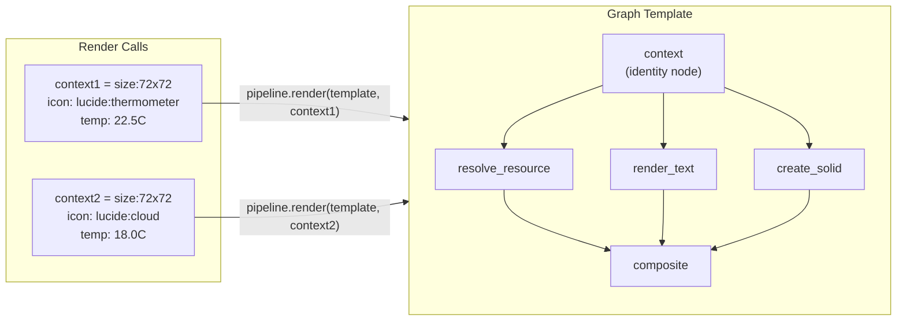

# **invariant\_gfx: The Functional Graphics Pipeline**

**invariant\_gfx** is a deterministic, DAG-based graphics engine built on **Invariant**. It allows developers to build complex visual assets (like Stream Deck buttons, dynamic badges, or data visualizations) by plugging together reusable "pipeline parts."

Unlike traditional imperative rendering (where you draw lines on a mutable canvas), invariant\_gfx is **functional**: every layer, mask, or composition is an immutable **Artifact** produced by a pure function.

## **1\. Core Philosophy**

### **The "Smart Op" Model**

Layout logic lives **inside** the Graph, not in a pre-processing step.

* **Traditional:** Calculate that "Hello" is 50px wide, then tell the draw command to place it at x=25.  
* **Invariant GFX:** Tell the composite Op to align the "Hello" artifact to center. The Op resolves the pixel math at runtime based on the actual size of the upstream inputs.

### **Explicit Data Flow (The "Switchboard")**

There is no "Global Context" or "Environment Variables."

* **Rule:** If a node needs data (like a URL or a temperature value), that data must be the output of an upstream **Identity Node**.  
* **Benefit:** The graph is hermetic. You can visualize exactly where every piece of data comes from.

### **Strict Numeric Policy**

All layout inputs (offsets, font sizes, opacity) use decimal.Decimal or int to ensure bit-level precision across architectures.

## **2\. Data Transfer Objects (Artifacts)**

We standardise on two Artifact types to ensure interoperability between all Ops. Both implement the `ICacheable` protocol from Invariant.

### **ImageArtifact**

The universal visual primitive passed between nodes.

* **Content:** A `PIL.Image` (standardized to **RGBA** mode).  
* **Serialization:** Canonical **PNG** (zlib level 1 compression, metadata stripped).  
* **Identity:** SHA-256 of the canonical PNG bytes (via `get_stable_hash()`).  
* **Properties:** Exposes `.width`, `.height`, and `.image` (the PIL.Image object).

**ICacheable Implementation:**

```python
class ImageArtifact(ICacheable):
    def __init__(self, image: PIL.Image):
        # Normalize to RGBA mode
        if image.mode != "RGBA":
            image = image.convert("RGBA")
        self.image = image
    
    @property
    def width(self) -> int:
        return self.image.width
    
    @property
    def height(self) -> int:
        return self.image.height
    
    def get_stable_hash(self) -> str:
        """SHA-256 of canonical PNG bytes."""
        import hashlib
        png_bytes = self._to_canonical_png()
        return hashlib.sha256(png_bytes).hexdigest()
    
    def to_stream(self, stream: BinaryIO) -> None:
        """Serialize as canonical PNG."""
        png_bytes = self._to_canonical_png()
        stream.write(len(png_bytes).to_bytes(8, byteorder="big"))
        stream.write(png_bytes)
    
    @classmethod
    def from_stream(cls, stream: BinaryIO) -> "ImageArtifact":
        """Deserialize from canonical PNG."""
        length = int.from_bytes(stream.read(8), byteorder="big")
        png_bytes = stream.read(length)
        from PIL import Image
        from io import BytesIO
        image = Image.open(BytesIO(png_bytes))
        return cls(image.convert("RGBA"))
    
    def _to_canonical_png(self) -> bytes:
        """Convert to canonical PNG (level 1, no metadata)."""
        from io import BytesIO
        buffer = BytesIO()
        self.image.save(buffer, format="PNG", compress_level=1, optimize=False)
        return buffer.getvalue()
```

### **BlobArtifact**

Container for raw binary resources (SVG, PNG, TTF, etc.).

* **Content:** Raw `bytes` + `content_type: str` (MIME type).  
* **Use Cases:** SVG source files, TTF font binaries, downloaded assets, icon pack resources.  
* **Identity:** SHA-256 of the raw bytes (via `get_stable_hash()`).

**ICacheable Implementation:**

```python
class BlobArtifact(ICacheable):
    def __init__(self, data: bytes, content_type: str):
        self.data = data
        self.content_type = content_type
    
    def get_stable_hash(self) -> str:
        """SHA-256 of raw bytes."""
        import hashlib
        return hashlib.sha256(self.data).hexdigest()
    
    def to_stream(self, stream: BinaryIO) -> None:
        """Serialize: [8 bytes: content_type_len][content_type][8 bytes: data_len][data]."""
        content_type_bytes = self.content_type.encode("utf-8")
        stream.write(len(content_type_bytes).to_bytes(8, byteorder="big"))
        stream.write(content_type_bytes)
        stream.write(len(self.data).to_bytes(8, byteorder="big"))
        stream.write(self.data)
    
    @classmethod
    def from_stream(cls, stream: BinaryIO) -> "BlobArtifact":
        """Deserialize from stream."""
        content_type_len = int.from_bytes(stream.read(8), byteorder="big")
        content_type = stream.read(content_type_len).decode("utf-8")
        data_len = int.from_bytes(stream.read(8), byteorder="big")
        data = stream.read(data_len)
        return cls(data, content_type)
```

## **3\. Operation Registry & Extensibility**

invariant\_gfx relies on the core **Invariant OpRegistry** to map string identifiers to executable Python logic. This decoupling allows the pipeline to be purely declarative while supporting infinite extensibility.

### **The Registry Pattern**

The pipeline does not contain code; it contains **references**. At runtime, the Executor looks up the op\_name in the Registry.

\# System initialization  
registry \= OpRegistry()

\# 1\. Register Standard Library (Core Ops)  
invariant\_gfx.register\_core\_ops(registry) 

\# 2\. Register Custom/Application Ops  
registry.register("myapp:custom\_filter", my\_custom\_filter\_op)

### **Namespacing Conventions**

To prevent collisions in extensible pipelines, we enforce a namespacing convention.

1. **Core Ops (op\_name)**: Reserved for the Standard Library.  
   * Examples: composite, render\_text, fetch\_resource.  
2. **Extension Ops (namespace:op\_name)**: For application-specific logic.  
   * Examples: filters:gaussian\_blur, analytics:render\_sparkline.

## **4\. The Op Standard Library (V1 Scope)**

These Ops form the "Instruction Set" of the graphics engine. The following ops are required for v1 deliverables (square canvases and custom-size dashboards).

### **Group A: Sources (Data Ingestion)**

#### **resolve\_resource**

Resolves bundled resources (icons, images) via JustMyResource.

* **Inputs:**  
  * `name`: String resource identifier with optional pack prefix (e.g., `"lucide:thermometer"`, `"material-icons:cloud"`).  
* **Output:** `BlobArtifact` containing the resource bytes.  
* **Implementation:** Wraps `ResourceRegistry.get_resource(name)` from JustMyResource.  
* **Use Case:** Fetching bundled icons from installed icon packs (Lucide, Material Icons, etc.).

#### **create\_solid**

Generates a solid color canvas.

* **Inputs:**  
  * `size`: Tuple\[Decimal, Decimal\] (width, height).  
  * `color`: RGBA Tuple\[int, int, int, int\] (0-255 per channel).  
* **Output:** `ImageArtifact` (RGBA mode).  
* **Use Case:** Creating background canvases for composite operations.

### **Group B: Transformers (Rendering)**

#### **render\_svg**

Converts SVG blobs into raster artifacts using cairosvg.

* **Inputs:**  
  * `svg_content`: `BlobArtifact` (the SVG XML bytes, accessed from upstream node via manifest).  
  * `width`: Decimal (target raster width in pixels).  
  * `height`: Decimal (target raster height in pixels).  
* **Output:** `ImageArtifact` (RGBA mode).  
* **Implementation:** Uses `justmyresource.render.svg_to_png()` internally.  
* **Security:** SVG rendering is sandboxed (no network access). All dependencies must be bundled.

#### **render\_text**

Creates a tight-fitting "Text Pill" artifact using Pillow.

* **Inputs:**  
  * `text`: String content to render.  
  * `font_family`: String font family name (e.g., `"Inter"`, `"Roboto"`).  
  * `size`: Decimal (font size in points).  
  * `color`: RGBA Tuple\[int, int, int, int\] (0-255 per channel).  
  * `weight`: int | None (font weight 100-900, optional).  
  * `style`: str (font style: `"normal"` or `"italic"`, default `"normal"`).  
* **Output:** `ImageArtifact` sized to the text bounding box (RGBA mode).  
* **Implementation:** Uses `FontRegistry.find_font()` from JustMyType to resolve font family, then `FontInfo.load()` to get `PIL.ImageFont`, then Pillow's text rendering.  
* **Use Case:** Rendering labels, temperatures, or other text content.

#### **resize**

Scales an `ImageArtifact` to target dimensions.

* **Inputs:**  
  * `image`: `ImageArtifact` (accessed from upstream node via manifest).  
  * `width`: Decimal (target width).  
  * `height`: Decimal (target height).  
* **Output:** `ImageArtifact` (resized, RGBA mode).  
* **Use Case:** Scaling downloaded images or intermediate compositions to fit canvas size.

### **Group C: Composition (Combiners)**

#### **composite**

Fixed-size composition engine. Stacks multiple layers onto a fixed-size canvas where each layer anchors to a previously-placed named layer.

* **Inputs:**  
  * `layers`: List\[LayerSpec\] (passed as plain Python list in params).
    * The first layer defines the canvas size (must have fixed dimensions).
    * Subsequent layers reference previously-placed layers by `id` using anchor specifications.
    * No special "canvas" or "background" concept—everything references named layers.

**LayerSpec Structure:**

Each `LayerSpec` is a dict with:
* `ref`: String node ID of upstream `ImageArtifact` (resolved from manifest).
* `id`: str | None (optional name, required if other layers reference this one).
* `anchor`: dict (anchor specification, see below).
* `mode`: str (blend mode: `"normal"`, `"multiply"`, `"screen"`, `"overlay"`, `"darken"`, `"lighten"`, `"add"`, default `"normal"`).  
* `opacity`: Decimal (0.0 to 1.0, default 1.0).

**Anchor Specification:**

The `anchor` dict positions a layer relative to a previously-placed named layer:

* **Fixed positioning (first layer):**
  ```python
  {"type": "fixed", "x": Decimal("0"), "y": Decimal("0")}
  ```

* **Relative positioning (subsequent layers):**
  ```python
  {
      "type": "relative",
      "target": "layer_id",  # ID of previously-placed layer
      "align": "c,c",  # Alignment string (see below)
      "x": Decimal("0"),  # Optional offset
      "y": Decimal("0"),  # Optional offset
  }
  ```

**Alignment String Format:**

Comma-separated pair using `s` (start), `c` (center), `e` (end):
* First value = self alignment (which point on *this* layer)
* Second value = reference alignment (which point on the *referenced* layer)
* Examples:
  * `"c,c"` = center of self aligns to center of reference (centered)
  * `"s,e"` = start of self aligns to end of reference (outside placement / badge)
  * `"e,e"` = end of self aligns to end of reference (right/bottom aligned)
  * `"se,ee"` = on x-axis: self-start to ref-end; on y-axis: self-end to ref-end (text following on same baseline)

**Examples:**
* `{"type": "relative", "target": "bg", "align": "c,c"}` - center element on 'bg' layer
* `{"type": "relative", "target": "bg", "align": "e,e"}` - bottom-right align to 'bg' layer
* `{"type": "relative", "target": "bg", "align": "c,c", "y": Decimal("5")}` - center on 'bg', shifted 5px down

#### **layout**

Content-sized arrangement engine. Arranges items in a flow (row or column) when the output size is not known upfront.

* **Inputs:**  
  * `direction`: `"row"` or `"column"` (main axis flow direction).  
  * `align`: Cross-axis alignment using `"s"` (start), `"c"` (center), or `"e"` (end).  
  * `gap`: Decimal (spacing between items in pixels).  
  * `items`: List\[str\] (ordered list of upstream node IDs that produce `ImageArtifact`s).  
* **Output**: `ImageArtifact` sized to the tight bounding box of the arranged items (RGBA mode).  
* **Key difference from composite**: No anchoring to named layers; items flow sequentially. Output size is derived from content, not fixed.  
* **Use Case:** Arranging icon + text vertically, or multiple elements horizontally before compositing onto a fixed-size background.

### **Group D: Type Conversion (Casting)**

#### **blob\_to\_image**

Parses raw binary data (PNG, JPEG, WEBP) into a decoded `ImageArtifact`.

* **Inputs:**  
  * `blob`: `BlobArtifact` (accessed from upstream node via manifest).  
* **Output:** `ImageArtifact` (RGBA mode).  
* **Purpose:** Allows downloaded raster images (from `fetch_resource` or external sources) to be used in composite (which requires dimensions) or as assets in render\_svg.  
* **Use Case:** Converting downloaded PNG/JPEG images into compositable artifacts.

### **Deferred Ops (Post-V1)**

The following ops are planned but not required for v1:

* **fetch\_resource**: HTTP download with version-based caching (for external assets).
* **render\_shape**: Primitive vector shapes (rect, rounded\_rect, ellipse, line) rendered directly to `ImageArtifact`.

## **5\. Missing Upstream Features (Gaps in Invariant)**

After reviewing the actual Invariant codebase, here is the accurate status of features needed by invariant_gfx:

| Feature | Doc Says Missing | Actual Status |
| :---- | :---- | :---- |
| **Expression Evaluation** (`${...}`) | Missing | **Not needed for v1.** The Executor already populates the manifest with upstream artifacts keyed by dep node ID. Ops access upstream results directly from the manifest (e.g., `manifest["upstream_node_id"]`). No template syntax required. |
| **Context Injection** | Missing | **Solvable via Pipeline wrapper.** The Pipeline class (to be implemented in invariant_gfx) can accept a context dict and auto-create identity nodes at the graph root. This provides the ergonomic API without requiring changes to Invariant core. |
| **Pipeline Class** | Missing | **To be implemented in invariant_gfx.** Wraps Executor with context support and dual-cache (MemoryStore + DiskStore). See Section 7 for design. |
| **List/Dict Cacheable Types** | Missing | **Partially available.** `hash_value()` in Invariant already hashes lists/dicts recursively. However, `List` and `Dict` as top-level `ICacheable` types (with `to_stream`/`from_stream`) do not exist. **Workaround for v1:** Pass layer specs as plain Python dicts/lists in params. The manifest hashing will work, but these cannot be stored as standalone artifacts. For v1, this is acceptable since layer specs are only intermediate data. |
| **Op Namespace Enforcement** | Missing | **Not needed for v1.** Convention-based namespacing (core ops use bare names, extensions use `namespace:op_name`) is sufficient. Manual enforcement via code review is acceptable. |

**V1 Approach:** The Pipeline wrapper handles context injection. Ops access upstream artifacts via manifest keys (dep node IDs). Layer specs are passed as plain dicts/lists (not as ICacheable artifacts) since they're only used in manifests, not stored independently.

## **6\. Dependency Integration**

invariant_gfx integrates with two key dependencies for resource discovery:

### **Font Resolution (JustMyType)**

The `render_text` op uses JustMyType's `FontRegistry` to resolve font family names to actual font files:

* **Input:** Font family name as a string (e.g., `"Inter"`, `"Roboto"`)
* **Resolution:** `FontRegistry.find_font(family, weight, style, width)` returns a `FontInfo` object
* **Loading:** `FontInfo.load(size)` produces a `PIL.ImageFont.FreeTypeFont` for Pillow text rendering
* **Location:** Font resolution happens **inside** the op; the graph passes only the font family name string (not a font blob)

This design keeps the graph declarative—nodes specify "use Inter font" rather than managing font file paths.

### **Icon/Resource Resolution (JustMyResource)**

The `resolve_resource` op wraps JustMyResource's `ResourceRegistry` to fetch bundled icons and other resources:

* **Input:** Resource identifier with optional pack prefix (e.g., `"lucide:thermometer"`, `"material-icons:cloud"`)
* **Resolution:** `ResourceRegistry.get_resource(name)` returns a `ResourceContent` object containing:
  * `data: bytes` (raw SVG or raster bytes)
  * `content_type: str` (MIME type, e.g., `"image/svg+xml"`, `"image/png"`)
  * `encoding: str | None` (for text-based resources)
  * `metadata: dict | None` (optional pack-specific info)
* **Output:** A `BlobArtifact` containing the resource bytes
* **Rasterization:** The `render_svg` op then converts SVG blobs to `ImageArtifact` using cairosvg (via JustMyResource's `render.svg_to_png()` helper)

**Icon Pack Discovery:** Icon packs (Lucide, Material Icons, etc.) are installed via `justmyresource[icons]` and discovered automatically via Python EntryPoints. No URL fetching is needed for bundled icons—they're resolved from installed packages.

**Note:** The `fetch_resource` op (for external HTTP URLs) remains available for downloading remote assets, but bundled icons should use `resolve_resource` for better performance and determinism.

## **7\. Pipeline Class Design**

The `Pipeline` class is an ergonomic wrapper around Invariant's `Executor` that provides:

1. **Context Injection:** Automatically creates identity nodes from a context dict
2. **Dual-Cache Strategy:** ChainStore combining MemoryStore (session-scoped) and DiskStore (persistent)
3. **Simplified API:** Single `render()` method that takes a graph template and context

### **API Design**

```python
from invariant_gfx import Pipeline
from invariant import Node
from invariant_gfx.artifacts import ImageArtifact

pipeline = Pipeline()  # Uses ChainStore(MemoryStore(), DiskStore()) by default

# Render a template with context
result: ImageArtifact = pipeline.render(
    graph=my_template_graph,
    context={
        "size": {"width": 72, "height": 72},
        "icon": "lucide:thermometer",
        "temperature": "22.5°C",
    },
    output="final",  # Node ID to return
)
```

### **Dual-Cache Strategy: ChainStore**

The `ChainStore` (to be implemented) provides a two-tier caching system:

* **MemoryStore (L1):** Fast, session-scoped cache. Checked first for hot-path performance (same template rendered with different contexts).
* **DiskStore (L2):** Persistent filesystem cache. Checked if MemoryStore misses. Promotes artifacts to MemoryStore on hit.

This design optimizes for the common v1 use case: rendering the same template multiple times with different context values (e.g., generating 15 Stream Deck buttons from one template).

### **Context Injection Mechanism**

When `Pipeline.render()` is called with a `context` dict:

1. The Pipeline creates an identity node (e.g., `"context"`) with `params={"value": context}`
2. The context dict is wrapped in an `ICacheable` container (e.g., a `Dict` type, or for v1, a simple wrapper)
3. The graph is augmented with this context node
4. Other nodes can depend on `"context"` and access values via the manifest

For v1, since `Dict` as an `ICacheable` type doesn't exist, the context will be stored as a plain dict in the identity node's params. The manifest hashing will still work correctly.

## **8\. Template + Context Rendering Pattern**

The v1 key deliverable is: **design a pipeline template, then provide context (including size) to render a version**.

A **template** is a graph dict with a context identity node at its root. The Pipeline's `render()` method injects the context values and executes:



**Benefits:**
- Same template reused across multiple renders (caching at template level)
- Context values change per render (different icons, text, sizes)
- Hot-path optimization: MemoryStore caches intermediate artifacts from the template structure
- Deterministic: Same context always produces the same output (bit-for-bit identical)

## **9\. Pipeline Example: The Thermometer**

This example demonstrates the **template + context** pattern: a graph template that accepts context (size, icon, temperature) and renders a Stream Deck button.

```python
from invariant import Node
from invariant_gfx import Pipeline
from invariant_gfx.artifacts import ImageArtifact, BlobArtifact
from decimal import Decimal

# Define the template graph
template = {
    # Context node (will be injected by Pipeline.render())
    "context": Node(
        op_name="identity",
        params={"value": {}},  # Placeholder - Pipeline will inject actual context
        deps=[],
    ),
    
    # Resolve icon resource
    "icon_blob": Node(
        op_name="resolve_resource",
        params={
            "name": "lucide:thermometer",  # Will be overridden by context
        },
        deps=["context"],
    ),
    
    # Render icon SVG to raster
    "icon": Node(
        op_name="render_svg",
        params={
            "svg_content": None,  # Will be populated from icon_blob artifact
            "width": Decimal("50"),
            "height": Decimal("50"),
        },
        deps=["icon_blob"],
    ),
    
    # Render temperature text
    "text": Node(
        op_name="render_text",
        params={
            "text": "22.5°C",  # Will be overridden by context
            "font_family": "Inter",
            "size": Decimal("12"),
            "color": (255, 255, 255, 255),  # White RGBA
        },
        deps=["context"],
    ),
    
    # Create background
    "background": Node(
        op_name="create_solid",
        params={
            "size": (Decimal("72"), Decimal("72")),  # Will be overridden by context
            "color": (40, 40, 40, 255),  # Dark gray RGBA
        },
        deps=["context"],
    ),
    
    # Layout icon and text vertically
    "content": Node(
        op_name="layout",
        params={
            "direction": "column",
            "align": "c",
            "gap": Decimal("5"),
            "items": ["icon", "text"],  # References to upstream node IDs
        },
        deps=["icon", "text"],
    ),
    
    # Composite onto background
    "final": Node(
        op_name="composite",
        params={
            "layers": [
                {
                    "ref": "background",  # Reference to upstream node ID
                    "id": "bg",
                    "anchor": {"type": "fixed", "x": 0, "y": 0},  # First layer defines canvas
                },
                {
                    "ref": "content",
                    "id": "content_layer",
                    "anchor": {"type": "relative", "target": "bg", "align": "c,c"},  # Center on bg
                },
            ],
        },
        deps=["background", "content"],
    ),
}

# Initialize pipeline
pipeline = Pipeline()

# Render with different contexts
result1: ImageArtifact = pipeline.render(
    graph=template,
    context={
        "size": {"width": 72, "height": 72},
        "icon": "lucide:thermometer",
        "temperature": "22.5°C",
    },
    output="final",
)

result2: ImageArtifact = pipeline.render(
    graph=template,
    context={
        "size": {"width": 72, "height": 72},
        "icon": "lucide:cloud",
        "temperature": "18.0°C",
    },
    output="final",
)
```

**Note:** The actual implementation will need to:
- Extract context values inside ops (e.g., `render_text` reads `context["temperature"]` from the manifest)
- Resolve upstream artifacts from manifest keys (e.g., `manifest["icon_blob"]` returns the `BlobArtifact`)
- Handle the anchor system for `composite` (simplified in this example)

This example shows the intended API pattern; the actual op implementations will handle manifest resolution internally.

This example demonstrates the **layout** and **composite** ops working together: `layout` arranges content-sized elements, then `composite` places the result onto a fixed-size background.

```python
from invariant import Node
from invariant_gfx import Pipeline  # Pipeline wrapper (may move to invariant core in future)
from decimal import Decimal

# Note: Expression evaluation (${...}) and context injection are planned features
# not yet implemented in Invariant. Until then, use identity nodes for external inputs.
render_input = {
    "font": "Inter",
    "icon": "lucide:thermometer",
    "background": "http://example.com/someimage.jpg",
    "temperature": f"{temp:.1f}",
    "height": 122,
    "width": 122,
}

graph = {  
    # --- 1. Context Input (Identity Node) ---
    # Until context injection is implemented, external data must come via identity nodes
    "input": Node(
        op_name="identity",
        params={"value": render_input},  # In future: context={"input": render_input}
        deps=[]
    ),
    
    # --- 2. Asset Loading ---  
    "background_image": Node(  
        op_name="fetch_resource",  
        params={  
            # TODO: Expression evaluation (${input.background}) not yet implemented
            # For now, use literal values or identity node outputs
            "url": render_input["background"],  # Future: "${input.background}"
            "version": 1,  # This is a 'cache buster' since this op is only re-run if the inputs change
        },  
        deps=["input"]  
    ),  

    "background_image_render": Node(
        op_name="resize",
        params={
            # TODO: Expression evaluation not yet implemented
            "image": None,  # Future: "${background_image.data}" - would reference upstream artifact
            "width": render_input["width"],  # Future: "${input.width}"
            "height": render_input["height"],  # Future: "${input.height}"
        },
        deps=["input", "background_image"]
    ),

    "thermo_icon_src": Node(  
        op_name="svg_icon",  # Uses resolution mechanism mentioned in docs/icons.md - we'll probably call that JustMyResource
        params={
            # TODO: Expression evaluation not yet implemented
            "ref": render_input["icon"]  # Future: "${input.icon}"
        },  
        deps=["input"]  
    ),

    # --- 3. Processing ---  
    "text_render": Node(  
        op_name="render_text",  
        params={  
            # TODO: Expression evaluation not yet implemented
            "text": render_input["temperature"],  # Future: "${input.temperature}"
            "font": "Inter",  # Uses JustMyType to resolve the correct font https://github.com/kws/justmytype
            "size": Decimal("11.5"),  
            "color": "#FFF"  
        },  
        deps=["input"]  
    ),

    "thermo_icon": Node(  
        op_name="render_svg",  
        params={  
            # TODO: Expression evaluation not yet implemented
            "svg_content": None,  # Future: "${thermo_icon_src.svg_string}" - would reference upstream artifact
            "width": Decimal(str(int(render_input["width"]) * 0.8)),  # Future: "${Decimal(input.width) * Decimal('0.8')}"
            "height": Decimal(str(int(render_input["height"]) * 0.8)),  # Future: "${Decimal(input.height) * Decimal('0.8')}"
        },  
        deps=["thermo_icon_src"]  
    ),

    # --- 4. Content Layout (Content-Sized) ---  
    "gauge_layout": Node(
        op_name="layout",
        params={
            "direction": "column",
            "align": "c",
            "gap": Decimal("5"),
            # TODO: Expression evaluation and List cacheable type not yet implemented
            # Future: items=["${thermo_icon.image}", "${text_render.image}"]
            # For now, would need to construct list from upstream artifacts
            "items": []  # Placeholder - actual implementation pending
        },
        deps=["thermo_icon", "text_render"]
    ),

    # --- 5. Final Composition (Fixed-Size) ---  
    "final": Node(
        op_name="composite",
        params={
            # TODO: Expression evaluation and List/Dict cacheable types not yet implemented
            # Future: layers=[{...}, {...}] with ${...} expressions
            "layers": []  # Placeholder - actual implementation pending
        },
        deps=["background_image_render", "gauge_layout"]
    )  
}  

# Pipeline wrapper (may move to invariant core in future)
# TODO: Context injection not yet implemented - currently Executor.execute() only accepts graph
pipeline = Pipeline(decimal_prec=2)  # Ergonomic wrapper around Executor with cache location and default decimal precision
# Future: final_image = pipeline.render(graph, context={"input": render_input})
# Current: artifacts = pipeline.executor.execute(graph); final_image = artifacts["final"]
```
