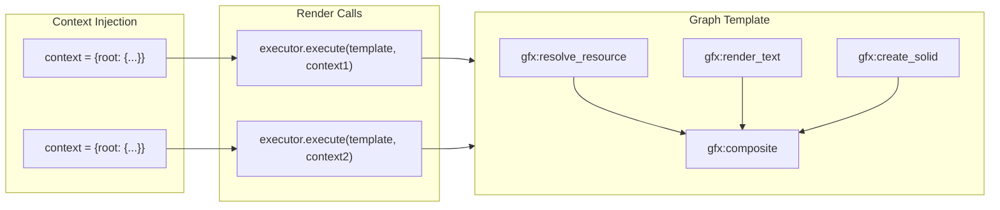
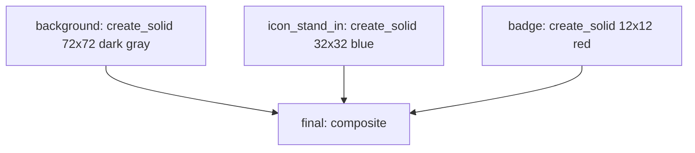
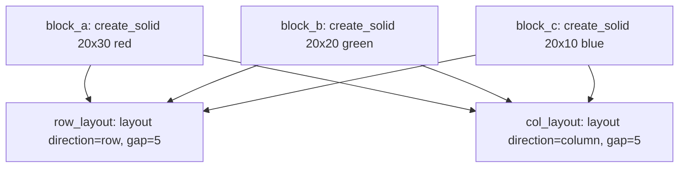
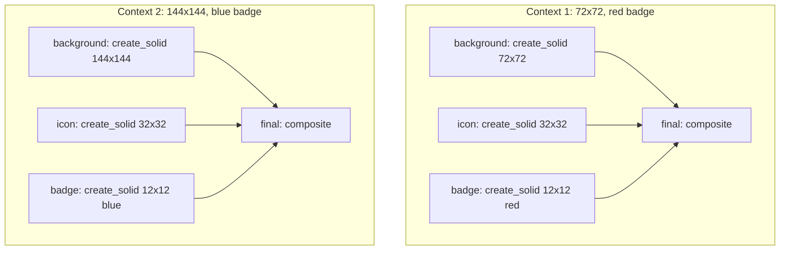

# **invariant\_gfx: The Functional Graphics Pipeline**

**invariant\_gfx** is a deterministic, DAG-based graphics engine built on **Invariant**. It allows developers to build complex visual assets (like Stream Deck buttons, dynamic badges, or data visualizations) by plugging together reusable "pipeline parts."

Unlike traditional imperative rendering (where you draw lines on a mutable canvas), invariant\_gfx is **functional**: every layer, mask, or composition is an immutable **Artifact** produced by a pure function.

## **1\. Core Philosophy**

### **The "Smart Op" Model**

Layout logic lives **inside** the Graph, not in a pre-processing step.

* **Traditional:** Calculate that "Hello" is 50px wide, then tell the draw command to place it at x=25.  
* **Invariant GFX:** Tell the composite Op to align the "Hello" artifact to center. The Op resolves the pixel math at runtime based on the actual size of the upstream inputs.

### **Explicit Data Flow (The "Switchboard")**

There is no "Global Context" or "Environment Variables."

* **Rule:** If a node needs data (like a URL or a temperature value), that data is either the output of an upstream node in the graph, or an external dependency provided via `context` when executing the graph.  
* **Benefit:** The graph is hermetic. You can visualize exactly where every piece of data comes from.

### **Strict Numeric Policy**

All layout inputs (offsets, font sizes, opacity) use decimal.Decimal or int to ensure bit-level precision across architectures.

## **2\. Data Transfer Objects (Artifacts)**

We standardise on two Artifact types to ensure interoperability between all Ops. Both implement the `ICacheable` protocol from Invariant.

### **ImageArtifact**

The universal visual primitive passed between nodes.

* **Content:** A `PIL.Image` (standardized to **RGBA** mode).  
* **Serialization:** Canonical **PNG** (zlib level 1 compression, metadata stripped).  
* **Identity:** SHA-256 of the canonical PNG bytes (via `get_stable_hash()`).  
* **Properties:** Exposes `.width`, `.height`, and `.image` (the PIL.Image object).

**ICacheable Implementation:**

```python
class ImageArtifact(ICacheable):
    def __init__(self, image: PIL.Image):
        # Normalize to RGBA mode
        if image.mode != "RGBA":
            image = image.convert("RGBA")
        self.image = image
    
    @property
    def width(self) -> int:
        return self.image.width
    
    @property
    def height(self) -> int:
        return self.image.height
    
    def get_stable_hash(self) -> str:
        """SHA-256 of canonical PNG bytes."""
        import hashlib
        png_bytes = self._to_canonical_png()
        return hashlib.sha256(png_bytes).hexdigest()
    
    def to_stream(self, stream: BinaryIO) -> None:
        """Serialize as canonical PNG."""
        png_bytes = self._to_canonical_png()
        stream.write(len(png_bytes).to_bytes(8, byteorder="big"))
        stream.write(png_bytes)
    
    @classmethod
    def from_stream(cls, stream: BinaryIO) -> "ImageArtifact":
        """Deserialize from canonical PNG."""
        length = int.from_bytes(stream.read(8), byteorder="big")
        png_bytes = stream.read(length)
        from PIL import Image
        from io import BytesIO
        image = Image.open(BytesIO(png_bytes))
        return cls(image.convert("RGBA"))
    
    def _to_canonical_png(self) -> bytes:
        """Convert to canonical PNG (level 1, no metadata)."""
        from io import BytesIO
        buffer = BytesIO()
        self.image.save(buffer, format="PNG", compress_level=1, optimize=False)
        return buffer.getvalue()
```

### **BlobArtifact**

Container for raw binary resources (SVG, PNG, TTF, etc.).

* **Content:** Raw `bytes` + `content_type: str` (MIME type).  
* **Use Cases:** SVG source files, TTF font binaries, downloaded assets, icon pack resources.  
* **Identity:** SHA-256 of the raw bytes (via `get_stable_hash()`).

**ICacheable Implementation:**

```python
class BlobArtifact(ICacheable):
    def __init__(self, data: bytes, content_type: str):
        self.data = data
        self.content_type = content_type
    
    def get_stable_hash(self) -> str:
        """SHA-256 of raw bytes."""
        import hashlib
        return hashlib.sha256(self.data).hexdigest()
    
    def to_stream(self, stream: BinaryIO) -> None:
        """Serialize: [8 bytes: content_type_len][content_type][8 bytes: data_len][data]."""
        content_type_bytes = self.content_type.encode("utf-8")
        stream.write(len(content_type_bytes).to_bytes(8, byteorder="big"))
        stream.write(content_type_bytes)
        stream.write(len(self.data).to_bytes(8, byteorder="big"))
        stream.write(self.data)
    
    @classmethod
    def from_stream(cls, stream: BinaryIO) -> "BlobArtifact":
        """Deserialize from stream."""
        content_type_len = int.from_bytes(stream.read(8), byteorder="big")
        content_type = stream.read(content_type_len).decode("utf-8")
        data_len = int.from_bytes(stream.read(8), byteorder="big")
        data = stream.read(data_len)
        return cls(data, content_type)
```

## **3\. Operation Registry & Extensibility**

invariant\_gfx relies on the core **Invariant OpRegistry** to map string identifiers to executable Python logic. This decoupling allows the pipeline to be purely declarative while supporting infinite extensibility.

### **The Registry Pattern**

The pipeline does not contain code; it contains **references**. At runtime, the Executor looks up the op\_name in the Registry.

\# System initialization  
registry \= OpRegistry()

\# 1\. Register Standard Library (Core Ops)  
invariant\_gfx.register\_core\_ops(registry)  # Registers as gfx:resolve_resource, gfx:render_text, etc.

\# 2\. Register Custom/Application Ops  
registry.register("myapp:custom\_filter", my\_custom\_filter\_op)

### **Namespacing Conventions**

To prevent collisions in extensible pipelines, we enforce a namespacing convention.

1. **Core Ops (gfx:op\_name)**: Reserved for the Standard Library.  
   * Examples: gfx:composite, gfx:render\_text, gfx:create\_solid.  
2. **Extension Ops (namespace:op\_name)**: For application-specific logic.  
   * Examples: filters:gaussian\_blur, analytics:render\_sparkline.

## **4\. The Op Standard Library (V1 Scope)**

These Ops form the "Instruction Set" of the graphics engine. The following ops are required for v1 deliverables (square canvases and custom-size dashboards).

### **Group A: Sources (Data Ingestion)**

#### **gfx:resolve\_resource**

Resolves bundled resources (icons, images) via JustMyResource.

* **Inputs:**  
  * `name`: String resource identifier with optional pack prefix (e.g., `"lucide:thermometer"`, `"material-icons:cloud"`).  
* **Output:** `BlobArtifact` containing the resource bytes.  
* **Implementation:** Wraps `ResourceRegistry.get_resource(name)` from JustMyResource.  
* **Use Case:** Fetching bundled icons from installed icon packs (Lucide, Material Icons, etc.).

#### **gfx:create\_solid**

Generates a solid color canvas.

* **Inputs:**  
  * `size`: Tuple\[Decimal, Decimal\] (width, height).  
  * `color`: RGBA Tuple\[int, int, int, int\] (0-255 per channel).  
* **Output:** `ImageArtifact` (RGBA mode).  
* **Use Case:** Creating background canvases for composite operations.

#### **gfx:resolve\_font**

Resolves a font family name to its raw font file bytes via JustMyType.

* **Inputs:**  
  * `family`: String font family name (e.g., `"Inter"`, `"Roboto"`).  
  * `weight`: int | None (font weight 100-900, optional).  
  * `style`: str (font style: `"normal"` or `"italic"`, default `"normal"`).  
* **Output:** `BlobArtifact` with `content_type` set to `"font/ttf"`, `"font/otf"`, or `"font/sfnt"` as appropriate, containing the raw font file bytes.  
* **Implementation:** Wraps `FontRegistry.find_font(family, weight, style, width)` from JustMyType, reads the font file bytes, returns as `BlobArtifact`.  
* **Use Case:** Making font resolution an explicit, cacheable graph step; enabling custom font injection via context (user-provided font files as `BlobArtifact`).

### **Group B: Transformers (Rendering)**

#### **gfx:render\_svg**

Converts SVG blobs into raster artifacts using cairosvg.

* **Inputs:**  
  * `svg_content`: `str` (inline SVG XML), `bytes`, or `BlobArtifact` (accessed via `${upstream_node}` expression).  
  * `width`: Decimal (target raster width in pixels).  
  * `height`: Decimal (target raster height in pixels).  
* **Output:** `ImageArtifact` (RGBA mode).  
* **Implementation:** Uses `justmyresource.render.svg_to_png()` internally.  
* **Security:** SVG rendering is sandboxed (no network access). All dependencies must be bundled.

#### **gfx:render\_text**

Creates a tight-fitting "Text Pill" artifact using Pillow.

* **Inputs:**  
  * `text`: String content to render.  
  * `font`: String | `BlobArtifact` (font specification).  
    * If `str`: treated as a font family name (e.g., `"Inter"`, `"Roboto"`), resolved internally via JustMyType.  
    * If `BlobArtifact`: used directly as font file bytes (must be a valid TTF/OTF); raises an error if the blob is not a loadable font.  
  * `size`: Decimal (font size in points).  
  * `color`: RGBA Tuple\[int, int, int, int\] (0-255 per channel).  
  * `weight`: int | None (font weight 100-900, optional). Only applies when `font` is a string.  
  * `style`: str (font style: `"normal"` or `"italic"`, default `"normal"`). Only applies when `font` is a string.  
* **Output:** `ImageArtifact` sized to the text bounding box (RGBA mode).  
* **Implementation:**  
  * If `font` is a string: uses `FontRegistry.find_font()` from JustMyType to resolve font family, then `FontInfo.load()` to get `PIL.ImageFont`.  
  * If `font` is a `BlobArtifact`: loads font directly from the blob bytes using `PIL.ImageFont.truetype()`.  
  * Then uses Pillow's text rendering to create the image.  
* **Use Case:** Rendering labels, temperatures, or other text content.

#### **gfx:resize**

Scales an `ImageArtifact` to target dimensions.

* **Inputs:**  
  * `image`: `ImageArtifact` (accessed via `${upstream_node}` expression).  
  * `width`: Decimal (target width).  
  * `height`: Decimal (target height).  
* **Output:** `ImageArtifact` (resized, RGBA mode).  
* **Use Case:** Scaling downloaded images or intermediate compositions to fit canvas size.

### **Group C: Composition (Combiners)**

#### **gfx:composite**

Fixed-size composition engine. Stacks multiple layers onto a fixed-size canvas where each layer anchors to a previously-placed layer using a parent reference.

* **Inputs:**  
  * `layers`: `dict[str, AnchorSpec]` (passed as plain Python dict in params, keyed by dependency ID).
    * Keys are the node IDs from `deps` (the upstream `ImageArtifact` dependencies).
    * Values are anchor specifications (see Anchor Functions below).
    * The first layer (by z-order) defines the canvas size (must have fixed dimensions).
    * Subsequent layers reference previously-placed layers by their dependency ID using the `parent` parameter in `relative()`.

**Anchor Functions:**

Anchor specifications are created using builder functions that return plain dicts (for compatibility with Invariant's expression resolver):

* **`absolute(x, y)`** — Place at absolute pixel coordinates on the canvas:
  ```python
  absolute(x=0, y=0)  # Top-left corner
  absolute(x=10, y=20)  # Specific pixel position
  ```
  * `x`: `int | Decimal | str` (pixel offset from left edge). Accepts `str` for deferred `${...}` CEL expressions.
  * `y`: `int | Decimal | str` (pixel offset from top edge). Accepts `str` for deferred `${...}` CEL expressions.

* **`relative(parent, align, x=0, y=0)`** — Position relative to a previously-placed layer:
  ```python
  relative("background", "c,c")  # Center on background layer
  relative("folder", "se,se", x=5, y=-5)  # Top-right corner of folder, with offset
  ```
  * `parent`: `str` (dependency ID of the layer to position relative to). Must reference a layer that appears earlier in z-order.
  * `align`: `str` (alignment string, see below).
  * `x`: `int | Decimal | str` (optional horizontal offset in pixels, default 0). Accepts `str` for deferred `${...}` CEL expressions.
  * `y`: `int | Decimal | str` (optional vertical offset in pixels, default 0). Accepts `str` for deferred `${...}` CEL expressions.

**Alignment String Format:**

Comma-separated pair using `s` (start), `c` (center), `e` (end):
* First value = self alignment (which point on *this* layer)
* Second value = parent alignment (which point on the *parent* layer)
* Examples:
  * `"c,c"` = center of self aligns to center of parent (centered)
  * `"s,e"` = start of self aligns to end of parent (outside placement / badge)
  * `"e,e"` = end of self aligns to end of parent (right/bottom aligned)
  * `"se,ee"` = on x-axis: self-start to parent-end; on y-axis: self-end to parent-end (text following on same baseline)

**Z-Ordering and Parent Topology:**

Layers are drawn in the order determined by the parent reference topology:
* If the parent references form a **strict chain** (each layer has a unique parent, no siblings), z-order is unambiguous and follows the chain.
* If multiple layers share the same parent (siblings), z-order is ambiguous and the op will raise an error. In this case, you must either:
  * Restructure to form a chain (e.g., `badge` → `folder` → `background` instead of both `badge` and `folder` → `background`), or
  * Provide an explicit `layer_order` parameter (future enhancement).

**Additional Layer Properties:**

Each layer in the `layers` dict can optionally include:
* `mode`: `str` (blend mode: `"normal"`, `"multiply"`, `"screen"`, `"overlay"`, `"darken"`, `"lighten"`, `"add"`, default `"normal"`).
* `opacity`: `Decimal` (0.0 to 1.0, default 1.0).

These are specified by extending the anchor spec dict returned by `absolute()` or `relative()`.

**Examples:**

```python
# Simple two-layer composition: background + centered content
"final": Node(
    op_name="gfx:composite",
    params={
        "layers": {
            "background": absolute(0, 0),  # First layer defines canvas
            "content": relative("background", "c,c"),  # Center on background
        },
    },
    deps=["background", "content"],
)

# Three-layer: folder icon with badge on top-right corner
"final": Node(
    op_name="gfx:composite",
    params={
        "layers": {
            "background": absolute(0, 0),
            "folder": relative("background", "c,c"),  # Folder centered on background
            "badge": relative("folder", "se,se"),  # Badge at folder's top-right
        },
    },
    deps=["background", "folder", "badge"],
)

# With opacity and offset
"final": Node(
    op_name="gfx:composite",
    params={
        "layers": {
            "background": absolute(0, 0),
            "overlay": {
                **relative("background", "c,c", y=5),  # Center, shifted 5px down
                "opacity": Decimal("0.8"),  # 80% opacity
            },
        },
    },
    deps=["background", "overlay"],
)
```

**Note on CEL Expression Support:**

Builder functions (`absolute()`, `relative()`) return plain Python dicts. The upstream `_resolve_value()` function recursively walks dicts and lists, so `${...}` CEL expressions embedded in anchor specs (e.g., `relative("bg", "c,c", y="${icon.height + 10}")`) are evaluated during Phase 1 (Context Resolution) before the op executes. This allows dynamic positioning based on upstream artifact dimensions.

#### **gfx:layout**

Content-sized arrangement engine. Arranges items in a flow (row or column) when the output size is not known upfront.

* **Inputs:**  
  * `direction`: `"row"` or `"column"` (main axis flow direction).  
  * `align`: Cross-axis alignment using `"s"` (start), `"c"` (center), or `"e"` (end).  
  * `gap`: Decimal (spacing between items in pixels).  
  * `items`: List\[str\] (ordered list of upstream node IDs that produce `ImageArtifact`s).  
* **Output**: `ImageArtifact` sized to the tight bounding box of the arranged items (RGBA mode).  
* **Key difference from composite**: No anchoring to named layers; items flow sequentially. Output size is derived from content, not fixed.  
* **Use Case:** Arranging icon + text vertically, or multiple elements horizontally before compositing onto a fixed-size background.

**Note on `items` parameter:** Unlike `gfx:composite`'s `layers` dict (which contains complex nested anchor specs), `gfx:layout`'s `items` is a simple ordered list of dependency ID strings. This flat structure is acceptable within Invariant's params model since it contains no complex nested configuration—it's analogous to a `layer_order` list, just specifying the sequence of items to arrange.

### **Group D: Type Conversion (Casting)**

#### **gfx:blob\_to\_image**

Parses raw binary data (PNG, JPEG, WEBP) into a decoded `ImageArtifact`.

* **Inputs:**  
  * `blob`: `BlobArtifact` (accessed via `${upstream_node}` expression).  
* **Output:** `ImageArtifact` (RGBA mode).  
* **Purpose:** Allows downloaded raster images (from `fetch_resource` or external sources) to be used in composite (which requires dimensions) or as assets in render\_svg.  
* **Use Case:** Converting downloaded PNG/JPEG images into compositable artifacts.

### **Deferred Ops (Post-V1)**

The following ops are planned but not required for v1:

* **gfx:fetch\_resource**: HTTP download with version-based caching (for external assets).
* **gfx:render\_shape**: Primitive vector shapes (rect, rounded\_rect, ellipse, line) rendered directly to `ImageArtifact`.

## **5\. Missing Upstream Features (Gaps in Invariant)**

After reviewing the actual Invariant codebase, here is the accurate status of features needed by invariant_gfx:

| Feature | Status |
| :---- | :---- |
| **Expression Evaluation** (`${...}`) | **Implemented upstream.** CEL expressions via `${...}` syntax in `invariant/expressions.py`. Expressions are evaluated during Phase 1 (Context Resolution) when building manifests. |
| **Context Injection** | **Implemented upstream.** `Executor.execute(graph, context=...)` natively supports external dependencies. Dependencies not in the graph are resolved from the context dict. |
| **ChainStore** | **Implemented upstream.** `invariant/store/chain.py` provides MemoryStore (L1) + DiskStore (L2) two-tier cache with automatic promotion from L2 to L1 on cache hits. |
| **List/Dict Cacheable Types** | **Partial.** `hash_value()` in Invariant already hashes lists/dicts recursively. However, `List` and `Dict` as top-level `ICacheable` types (with `to_stream`/`from_stream`) do not exist. **V1 workaround:** Pass layer specs as plain Python dicts/lists in params. The manifest hashing will work, but these cannot be stored as standalone artifacts. For v1, this is acceptable since layer specs are only intermediate data. |

**V1 Approach:** Use `Executor` and `ChainStore` directly from upstream. Ops access upstream artifacts via `${...}` expressions in params (e.g., `"${icon_blob}"`). Layer specs are passed as plain dicts/lists (not as ICacheable artifacts) since they're only used in manifests, not stored independently.

### **5.1 Known Upstream Constraints**

**Manifest Key Collision:**

In Invariant's executor, parameter keys and dependency IDs share the same flat namespace in the manifest. The manifest construction process is:

1. `manifest.update(node.params)` — Raw params added
2. `manifest[dep_id] = artifact` — Artifacts added (overwrites params with same key)
3. `manifest.update(resolved_params)` — Resolved params added (**overwrites artifacts with same key**)

This means if a param key collides with a dep ID, the resolved param will **clobber** the artifact in the manifest. The op loses access to the upstream `ImageArtifact`.

**Implication for `gfx:composite`:**

Layer configurations must be nested under a separate param key (e.g., `"layers"`) to avoid collisions. This is why `gfx:composite` uses `layers: dict` rather than having each layer config as a top-level param keyed by dep ID. The `layers` dict is recursively walked by `_resolve_value()`, so CEL expressions inside anchor specs still work correctly.

**General Rule:**

When designing ops that need both artifact references and configuration, nest the configuration under a dedicated param key rather than using dep IDs as top-level param keys.

## **6\. Dependency Integration**

invariant_gfx integrates with two key dependencies for resource discovery:

### **Font Resolution (JustMyType)**

invariant_gfx supports two font resolution paths:

**1. Implicit Resolution (String-based):**
The `gfx:render_text` op can accept a font family name as a string (e.g., `"Inter"`, `"Roboto"`). When provided as a string:
* **Resolution:** Uses JustMyType's `FontRegistry.find_font(family, weight, style, width)` to locate the font file
* **Loading:** `FontInfo.load(size)` produces a `PIL.ImageFont` for Pillow text rendering
* **Location:** Font resolution happens **inside** the op; the graph passes only the font family name string

This design keeps the graph declarative—nodes specify "use Inter font" rather than managing font file paths.

**2. Explicit Resolution (`gfx:resolve_font`):**
The `gfx:resolve_font` op makes font resolution an explicit, cacheable graph step:
* **Input:** Font family name, weight, and style parameters
* **Output:** `BlobArtifact` containing the raw font file bytes (TTF/OTF)
* **Benefits:** 
  * Font resolution is cached independently (SHA-256 of font file bytes)
  * Enables custom font injection via context (user-provided font files as `BlobArtifact`)
  * Makes system font dependencies explicit in the graph

**3. Direct Font Injection:**
The `gfx:render_text` op can also accept a `BlobArtifact` directly as the `font` parameter:
* The blob must contain valid TTF/OTF font file bytes
* The op loads the font directly using `PIL.ImageFont.truetype()`
* Raises an error if the blob is not a loadable font
* When using a `BlobArtifact`, `weight` and `style` parameters are ignored (the font file's inherent weight/style is used)

### **Icon/Resource Resolution (JustMyResource)**

The `gfx:resolve_resource` op wraps JustMyResource's `ResourceRegistry` to fetch bundled icons and other resources:

* **Input:** Resource identifier with optional pack prefix (e.g., `"lucide:thermometer"`, `"material-icons:cloud"`)
* **Resolution:** `ResourceRegistry.get_resource(name)` returns a `ResourceContent` object containing:
  * `data: bytes` (raw SVG or raster bytes)
  * `content_type: str` (MIME type, e.g., `"image/svg+xml"`, `"image/png"`)
  * `encoding: str | None` (for text-based resources)
  * `metadata: dict | None` (optional pack-specific info)
* **Output:** A `BlobArtifact` containing the resource bytes
* **Rasterization:** The `gfx:render_svg` op then converts SVG blobs to `ImageArtifact` using cairosvg (via JustMyResource's `render.svg_to_png()` helper)

**Icon Pack Discovery:** Icon packs (Lucide, Material Icons, etc.) are installed via `justmyresource[icons]` and discovered automatically via Python EntryPoints. No URL fetching is needed for bundled icons—they're resolved from installed packages.

**Note:** The `gfx:fetch_resource` op (for external HTTP URLs) remains available for downloading remote assets, but bundled icons should use `gfx:resolve_resource` for better performance and determinism.

## **7\. Using Invariant's Executor and ChainStore**

invariant_gfx uses Invariant's `Executor` and `ChainStore` directly—no wrapper class is needed.

### **Executor Setup**

```python
from invariant import Executor, Node, OpRegistry
from invariant.store.chain import ChainStore
from invariant.store.memory import MemoryStore
from invariant.store.disk import DiskStore
from invariant_gfx.artifacts import ImageArtifact

# Register graphics ops
registry = OpRegistry()
invariant_gfx.register_core_ops(registry)  # Registers gfx:* ops

# Setup dual-cache: MemoryStore (L1) + DiskStore (L2)
store = ChainStore(
    l1=MemoryStore(),  # Fast, session-scoped
    l2=DiskStore(),    # Persistent filesystem cache
)

# Create executor
executor = Executor(registry=registry, store=store)
```

### **Context Injection**

The `Executor.execute()` method natively supports context injection:

```python
# Execute graph with external context
results = executor.execute(
    graph=my_graph,
    context={
        "root": {...},  # External dependencies (must be ICacheable)
    },
)

# Access result
final_image: ImageArtifact = results["final"]
```

Dependencies not in the graph are resolved from the `context` dict. No identity nodes needed.

## **8\. Template + Context Rendering Pattern**

The v1 key deliverable is: **design a pipeline template, then provide context (including size) to render a version**.

A **template** is a graph dict that references external dependencies via `deps`. The `Executor.execute()` method injects context values and executes:



**Benefits:**
- Same template reused across multiple renders (caching at template level)
- Context values change per render (different icons, text, sizes)
- Hot-path optimization: MemoryStore caches intermediate artifacts from the template structure
- Deterministic: Same context always produces the same output (bit-for-bit identical)

## **9\. Pipeline Example: The Thermometer**

This example demonstrates the **template + context** pattern: a graph template that accepts context (size, icon, temperature) and renders a Stream Deck button.

```python
from invariant import Node, Executor, OpRegistry
from invariant.store.chain import ChainStore
from invariant.store.memory import MemoryStore
from invariant.store.disk import DiskStore
from invariant_gfx.artifacts import ImageArtifact
from invariant_gfx.anchors import absolute, relative
from decimal import Decimal

# Register graphics ops
registry = OpRegistry()
invariant_gfx.register_core_ops(registry)  # Registers gfx:* ops

# Setup dual-cache
store = ChainStore(
    l1=MemoryStore(),
    l2=DiskStore(),
)

# Create executor
executor = Executor(registry=registry, store=store)

# Define the template graph
template = {
    # Resolve icon resource (name from context)
    "icon_blob": Node(
        op_name="gfx:resolve_resource",
        params={
            "name": "${root.icon}",  # Access context value via expression
        },
        deps=["root"],  # Declare root as external dependency
    ),
    
    # Render icon SVG to raster
    "icon": Node(
        op_name="gfx:render_svg",
        params={
            "svg_content": "${icon_blob}",  # Access upstream artifact via expression
            "width": Decimal("50"),
            "height": Decimal("50"),
        },
        deps=["icon_blob"],
    ),
    
    # Render temperature text (from context)
    "text": Node(
        op_name="gfx:render_text",
        params={
            "text": "${root.temperature}",  # Access context value via expression
            "font_family": "Inter",
            "size": Decimal("12"),
            "color": (255, 255, 255, 255),  # White RGBA
        },
        deps=["root"],
    ),
    
    # Create background (size from context)
    "background": Node(
        op_name="gfx:create_solid",
        params={
            "size": (Decimal("${root.size.width}"), Decimal("${root.size.height}")),  # Access nested context values
            "color": (40, 40, 40, 255),  # Dark gray RGBA
        },
        deps=["root"],
    ),
    
    # Layout icon and text vertically
    "content": Node(
        op_name="gfx:layout",
        params={
            "direction": "column",
            "align": "c",
            "gap": Decimal("5"),
            "items": ["icon", "text"],  # References to upstream node IDs
        },
        deps=["icon", "text"],
    ),
    
    # Composite onto background
    "final": Node(
        op_name="gfx:composite",
        params={
            "layers": {
                "background": absolute(0, 0),  # First layer defines canvas
                "content": relative("background", "c,c"),  # Center on background
            },
        },
        deps=["background", "content"],
    ),
}

# Render with different contexts
# Note: Context values must be ICacheable. For complex nested data, you may need
# to create wrapper types or use identity nodes to convert plain dicts to ICacheable.
result1: ImageArtifact = executor.execute(
    graph=template,
    context={
        "root": {
            "size": {"width": 72, "height": 72},
            "icon": "lucide:thermometer",
            "temperature": "22.5°C",
        },
    },
)["final"]

result2: ImageArtifact = executor.execute(
    graph=template,
    context={
        "root": {
            "size": {"width": 72, "height": 72},
            "icon": "lucide:cloud",
            "temperature": "18.0°C",
        },
    },
)["final"]
```

This example demonstrates the **layout** and **composite** ops working together: `gfx:layout` arranges content-sized elements, then `gfx:composite` places the result onto a fixed-size background.

## **10\. Reference Test Pipelines**

To validate invariant_gfx's core capabilities—composition, layout, anchoring, caching, and context injection—we need reference test cases that exercise complex DAG structures without requiring external font or icon dependencies. **Pure geometric compositions** serve as ideal reference implementations.

### **10.1 Why Geometric Compositions**

Geometric compositions (colored rectangles, solid canvases) are well-suited for testing invariant_gfx because:

* **No external dependencies** — uses only `gfx:create_solid`, `gfx:resize`, `gfx:composite`, and `gfx:layout` (no fonts, icons, or network resources).
* **Pixel-verifiable** — output dimensions and pixel colors at known coordinates can be asserted programmatically.
* **Natural DAG structure** — composition pipelines require chains, fan-out, fan-in, and re-convergence.
* **Non-trivial cost** — image composition operations are O(width * height), making caching meaningful even in a test.
* **Graphics-specific patterns** — exercises anchoring, layout flow, and template reuse patterns unique to graphics pipelines.

### **10.2 Use Case 1: "Layered Badge" — Composition and Anchoring**

Tests the core composition engine with `absolute()` and `relative()` positioning. Three colored rectangles are stacked using different alignment modes.

**DAG Structure:**



**Complete Example:**

```python
from invariant import Node, Executor, OpRegistry
from invariant.store.memory import MemoryStore
from invariant_gfx.artifacts import ImageArtifact
from invariant_gfx.anchors import absolute, relative
from decimal import Decimal

# Register graphics ops
registry = OpRegistry()
invariant_gfx.register_core_ops(registry)

# Define the graph
graph = {
    # Create three colored rectangles
    "background": Node(
        op_name="gfx:create_solid",
        params={
            "size": (Decimal("72"), Decimal("72")),
            "color": (40, 40, 40, 255),  # Dark gray RGBA
        },
        deps=[],
    ),
    "icon_stand_in": Node(
        op_name="gfx:create_solid",
        params={
            "size": (Decimal("32"), Decimal("32")),
            "color": (0, 100, 200, 255),  # Blue RGBA
        },
        deps=[],
    ),
    "badge": Node(
        op_name="gfx:create_solid",
        params={
            "size": (Decimal("12"), Decimal("12")),
            "color": (200, 0, 0, 255),  # Red RGBA
        },
        deps=[],
    ),
    # Composite: background at origin, icon centered, badge at icon's top-right
    "final": Node(
        op_name="gfx:composite",
        params={
            "layers": {
                "background": absolute(0, 0),  # First layer defines canvas
                "icon_stand_in": relative("background", "c,c"),  # Center on background
                "badge": relative("icon_stand_in", "se,se", x=-2, y=2),  # Top-right of icon, with offset
            },
        },
        deps=["background", "icon_stand_in", "badge"],
    ),
}

store = MemoryStore()
executor = Executor(registry=registry, store=store)
results = executor.execute(graph)

# Verify output dimensions
assert results["final"].width == 72
assert results["final"].height == 72

# Verify pixel colors at known coordinates
final_image = results["final"].image
# Center pixel should be blue (icon)
assert final_image.getpixel((36, 36)) == (0, 100, 200, 255)
# Top-left corner should be dark gray (background)
assert final_image.getpixel((0, 0)) == (40, 40, 40, 255)
# Badge region should have red pixels
# Badge is positioned at icon's top-right, so approximately at (72-12-2, 0+2) = (58, 2)
assert final_image.getpixel((58, 2)) == (200, 0, 0, 255)
```

**Pipeline Features Exercised:**

| Pipeline Feature | Where It Appears | Notes |
|:--|:--|:--|
| **Source ops** | `background`, `icon_stand_in`, `badge` | Three independent `gfx:create_solid` nodes |
| **Composite with anchors** | `final` node | Three-layer composition |
| **`absolute()` anchoring** | `background` layer | Fixed pixel coordinates |
| **`relative()` with `"c,c"`** | `icon_stand_in` layer | Center alignment |
| **`relative()` with `"se,se"`** | `badge` layer | Start-end alignment (top-right) |
| **Fan-in (merge)** | `final` node | Three sources converge into one composite |
| **Pixel-level verification** | Assertions on `getpixel()` | Verifies correct positioning |

### **10.3 Use Case 2: "Content Flow" — Layout Engine**

Tests `gfx:layout` in both row and column modes with three differently-sized colored blocks. Demonstrates fan-out (same sources feed multiple layout nodes) and content-sized output.

**DAG Structure:**



**Complete Example:**

```python
from invariant import Node, Executor, OpRegistry
from invariant.store.memory import MemoryStore
from invariant_gfx.artifacts import ImageArtifact
from decimal import Decimal

# Register graphics ops
registry = OpRegistry()
invariant_gfx.register_core_ops(registry)

# Define the graph
graph = {
    # Create three differently-sized colored blocks
    "block_a": Node(
        op_name="gfx:create_solid",
        params={
            "size": (Decimal("20"), Decimal("30")),
            "color": (200, 0, 0, 255),  # Red RGBA
        },
        deps=[],
    ),
    "block_b": Node(
        op_name="gfx:create_solid",
        params={
            "size": (Decimal("20"), Decimal("20")),
            "color": (0, 200, 0, 255),  # Green RGBA
        },
        deps=[],
    ),
    "block_c": Node(
        op_name="gfx:create_solid",
        params={
            "size": (Decimal("20"), Decimal("10")),
            "color": (0, 0, 200, 255),  # Blue RGBA
        },
        deps=[],
    ),
    # Row layout: horizontal arrangement
    "row_layout": Node(
        op_name="gfx:layout",
        params={
            "direction": "row",
            "align": "c",  # Center on cross-axis
            "gap": Decimal("5"),
            "items": ["block_a", "block_b", "block_c"],
        },
        deps=["block_a", "block_b", "block_c"],
    ),
    # Column layout: vertical arrangement
    "col_layout": Node(
        op_name="gfx:layout",
        params={
            "direction": "column",
            "align": "c",  # Center on cross-axis
            "gap": Decimal("5"),
            "items": ["block_a", "block_b", "block_c"],
        },
        deps=["block_a", "block_b", "block_c"],
    ),
}

store = MemoryStore()
executor = Executor(registry=registry, store=store)
results = executor.execute(graph)

# Verify row layout dimensions
# Width = 20 + 5 + 20 + 5 + 20 = 70
# Height = max(30, 20, 10) = 30
assert results["row_layout"].width == 70
assert results["row_layout"].height == 30

# Verify column layout dimensions
# Width = max(20, 20, 20) = 20
# Height = 30 + 5 + 20 + 5 + 10 = 70
assert results["col_layout"].width == 20
assert results["col_layout"].height == 70

# Verify pixel colors at expected positions
row_image = results["row_layout"].image
# First block (red) at left edge
assert row_image.getpixel((10, 15)) == (200, 0, 0, 255)
# Second block (green) in middle
assert row_image.getpixel((35, 10)) == (0, 200, 0, 255)
# Third block (blue) at right edge
assert row_image.getpixel((60, 5)) == (0, 0, 200, 255)

col_image = results["col_layout"].image
# First block (red) at top
assert col_image.getpixel((10, 15)) == (200, 0, 0, 255)
# Second block (green) in middle
assert col_image.getpixel((10, 42)) == (0, 200, 0, 255)
# Third block (blue) at bottom
assert col_image.getpixel((10, 65)) == (0, 0, 200, 255)
```

**Pipeline Features Exercised:**

| Pipeline Feature | Where It Appears | Notes |
|:--|:--|:--|
| **Source ops** | `block_a`, `block_b`, `block_c` | Three independent `gfx:create_solid` nodes |
| **`gfx:layout` row mode** | `row_layout` node | Horizontal arrangement with gap |
| **`gfx:layout` column mode** | `col_layout` node | Vertical arrangement with gap |
| **Cross-axis alignment** | Both layout nodes | `align: "c"` centers items on cross axis |
| **Fan-out** | `block_a`, `block_b`, `block_c` | Same source blocks feed two layout nodes |
| **Content-sized output** | Both layout nodes | Output dimensions derived from content |
| **Pixel-level verification** | Assertions on `getpixel()` | Verifies correct arrangement order |

### **10.4 Use Case 3: "Template Reuse" — Caching and Context**

Tests the template + context pattern: same graph executed with two different contexts, verifying intermediate artifact cache reuse. This reuses the Layered Badge graph but wraps background size and badge color as context-injected values.

**DAG Structure:**



**Complete Example:**

```python
from invariant import Node, Executor, OpRegistry
from invariant.store.chain import ChainStore
from invariant.store.memory import MemoryStore
from invariant.store.disk import DiskStore
from invariant_gfx.artifacts import ImageArtifact
from invariant_gfx.anchors import absolute, relative
from decimal import Decimal

# Register graphics ops
registry = OpRegistry()
invariant_gfx.register_core_ops(registry)

# Setup dual-cache for persistence across runs
store = ChainStore(
    l1=MemoryStore(),
    l2=DiskStore(),
)

executor = Executor(registry=registry, store=store)

# Define the template graph (context-injected values)
template = {
    "background": Node(
        op_name="gfx:create_solid",
        params={
            "size": (Decimal("${root.size.width}"), Decimal("${root.size.height}")),
            "color": (40, 40, 40, 255),  # Dark gray RGBA
        },
        deps=["root"],
    ),
    "icon": Node(
        op_name="gfx:create_solid",
        params={
            "size": (Decimal("32"), Decimal("32")),
            "color": (0, 100, 200, 255),  # Blue RGBA (same across runs)
        },
        deps=[],
    ),
    "badge": Node(
        op_name="gfx:create_solid",
        params={
            "size": (Decimal("12"), Decimal("12")),
            "color": (Decimal("${root.badge_color.r}"), Decimal("${root.badge_color.g}"), Decimal("${root.badge_color.b}"), Decimal("255")),
        },
        deps=["root"],
    ),
    "final": Node(
        op_name="gfx:composite",
        params={
            "layers": {
                "background": absolute(0, 0),
                "icon": relative("background", "c,c"),
                "badge": relative("icon", "se,se", x=-2, y=2),
            },
        },
        deps=["background", "icon", "badge"],
    ),
}

# First run: 72x72 canvas with red badge
context1 = {
    "root": {
        "size": {"width": 72, "height": 72},
        "badge_color": {"r": 200, "g": 0, "b": 0},
    },
}
results1 = executor.execute(graph=template, context=context1)
assert results1["final"].width == 72
assert results1["final"].height == 72

# Second run: 144x144 canvas with blue badge
context2 = {
    "root": {
        "size": {"width": 144, "height": 144},
        "badge_color": {"r": 0, "g": 0, "b": 200},
    },
}
results2 = executor.execute(graph=template, context=context2)
assert results2["final"].width == 144
assert results2["final"].height == 144

# Third run: same as first run — should cache-hit on all nodes
results3 = executor.execute(graph=template, context=context1)
assert results3["final"].width == 72
assert results3["final"].height == 72

# Verify icon artifact was reused across all runs (same size, same color)
# The icon node has no context dependencies, so it should produce identical artifacts
# Note: In a real implementation, you would verify cache hits via store introspection
```

**Pipeline Features Exercised:**

| Pipeline Feature | Where It Appears | Notes |
|:--|:--|:--|
| **Template pattern** | Graph definition | Reusable graph with context placeholders |
| **Context injection** | `background`, `badge` nodes | Size and color from context |
| **Cache reuse** | Second execution with context1 | Identical context produces cache hits |
| **Artifact deduplication** | `icon` node | Same icon artifact reused across runs |
| **Fan-in (merge)** | `final` node | Three sources converge into one composite |
| **Different outputs** | `results1` vs `results2` | Context controls output dimensions |

### **10.5 Pipeline Features Summary**

| Pipeline Feature | Use Case 1 | Use Case 2 | Use Case 3 |
|:--|:--|:--|:--|
| **Source ops** (`gfx:create_solid`) | Yes | Yes | Yes |
| **`gfx:composite` with anchors** | Yes | — | Yes |
| **`gfx:layout` (row/column)** | — | Yes | — |
| **`absolute()` anchoring** | Yes | — | Yes |
| **`relative()` anchoring** | Yes | — | Yes |
| **Fan-out** | — | Yes | — |
| **Fan-in (merge)** | Yes | — | Yes |
| **Context injection** | — | — | Yes |
| **Cache reuse** | — | — | Yes |
| **Pixel-level verification** | Yes | Yes | Yes |

These three reference pipelines collectively exercise all core graphics operations and DAG patterns in invariant_gfx, providing a comprehensive test suite that validates the system's correctness, caching behavior, and template reuse capabilities.
