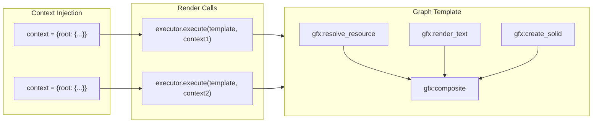

# **Invariant GFX: The Functional Graphics Pipeline**

**Invariant GFX** is a deterministic, DAG-based graphics engine built on **Invariant**. It allows developers to build complex visual assets (like Stream Deck buttons, dynamic badges, or data visualizations) by plugging together reusable "pipeline parts." Reusable DAG fragments can be expressed as **subgraphs** — see [Subgraphs (Invariant)](https://github.com/kws/invariant-core/blob/main/docs/subgraphs.md).

Unlike traditional imperative rendering (where you draw lines on a mutable canvas), Invariant GFX is **functional**: every layer, mask, or composition is an immutable **Artifact** produced by a pure function.

## **1\. Core Philosophy**

### **The "Smart Op" Model**

Layout logic lives **inside** the Graph, not in a pre-processing step.

* **Traditional:** Calculate that "Hello" is 50px wide, then tell the draw command to place it at x=25.  
* **Invariant GFX:** Tell the composite Op to align the "Hello" artifact to center. The Op resolves the pixel math at runtime based on the actual size of the upstream inputs.

### **Explicit Data Flow (The "Switchboard")**

There is no "Global Context" or "Environment Variables."

* **Rule:** If a node needs data (like a URL or a temperature value), that data is either the output of an upstream node in the graph, or an external dependency provided via `context` when executing the graph.  
* **Benefit:** The graph is hermetic. You can visualize exactly where every piece of data comes from.

### **Strict Numeric Policy**

All layout inputs (offsets, font sizes, opacity) use decimal.Decimal or int to ensure bit-level precision across architectures.

## **2\. Data Transfer Objects (Artifacts)**

We standardise on two Artifact types to ensure interoperability between all Ops. Both implement the `ICacheable` protocol from Invariant.

### **ImageArtifact**

The universal visual primitive passed between nodes.

* **Content:** A `PIL.Image` (standardized to **RGBA** mode).  
* **Serialization:** Canonical **PNG** (zlib level 1 compression, metadata stripped).  
* **Identity:** SHA-256 of the canonical PNG bytes (via `get_stable_hash()`).  
* **Properties:** Exposes `.width`, `.height`, and `.image` (the PIL.Image object).

**ICacheable Implementation:**

```python
class ImageArtifact(ICacheable):
    def __init__(self, image: PIL.Image):
        # Normalize to RGBA mode
        if image.mode != "RGBA":
            image = image.convert("RGBA")
        self.image = image
    
    @property
    def width(self) -> int:
        return self.image.width
    
    @property
    def height(self) -> int:
        return self.image.height
    
    def get_stable_hash(self) -> str:
        """SHA-256 of canonical PNG bytes."""
        import hashlib
        png_bytes = self._to_canonical_png()
        return hashlib.sha256(png_bytes).hexdigest()
    
    def to_stream(self, stream: BinaryIO) -> None:
        """Serialize as canonical PNG."""
        png_bytes = self._to_canonical_png()
        stream.write(len(png_bytes).to_bytes(8, byteorder="big"))
        stream.write(png_bytes)
    
    @classmethod
    def from_stream(cls, stream: BinaryIO) -> "ImageArtifact":
        """Deserialize from canonical PNG."""
        length = int.from_bytes(stream.read(8), byteorder="big")
        png_bytes = stream.read(length)
        from PIL import Image
        from io import BytesIO
        image = Image.open(BytesIO(png_bytes))
        return cls(image.convert("RGBA"))
    
    def _to_canonical_png(self) -> bytes:
        """Convert to canonical PNG (level 1, no metadata)."""
        from io import BytesIO
        buffer = BytesIO()
        self.image.save(buffer, format="PNG", compress_level=1, optimize=False)
        return buffer.getvalue()
```

### **BlobArtifact**

Container for raw binary resources (SVG, PNG, TTF, etc.).

* **Content:** Raw `bytes` + `content_type: str` (MIME type).  
* **Use Cases:** SVG source files, TTF font binaries, downloaded assets, icon pack resources.  
* **Identity:** SHA-256 of the raw bytes (via `get_stable_hash()`).

**ICacheable Implementation:**

```python
class BlobArtifact(ICacheable):
    def __init__(self, data: bytes, content_type: str):
        self.data = data
        self.content_type = content_type
    
    def get_stable_hash(self) -> str:
        """SHA-256 of raw bytes."""
        import hashlib
        return hashlib.sha256(self.data).hexdigest()
    
    def to_stream(self, stream: BinaryIO) -> None:
        """Serialize: [8 bytes: content_type_len][content_type][8 bytes: data_len][data]."""
        content_type_bytes = self.content_type.encode("utf-8")
        stream.write(len(content_type_bytes).to_bytes(8, byteorder="big"))
        stream.write(content_type_bytes)
        stream.write(len(self.data).to_bytes(8, byteorder="big"))
        stream.write(self.data)
    
    @classmethod
    def from_stream(cls, stream: BinaryIO) -> "BlobArtifact":
        """Deserialize from stream."""
        content_type_len = int.from_bytes(stream.read(8), byteorder="big")
        content_type = stream.read(content_type_len).decode("utf-8")
        data_len = int.from_bytes(stream.read(8), byteorder="big")
        data = stream.read(data_len)
        return cls(data, content_type)
```

## **3\. Operation Registry & Extensibility**

Invariant GFX relies on the core **Invariant OpRegistry** to map string identifiers to executable Python logic. This decoupling allows the pipeline to be purely declarative while supporting infinite extensibility.

### **The Registry Pattern**

The pipeline does not contain code; it contains **references**. At runtime, the Executor looks up the op\_name in the Registry.

\# System initialization  
registry \= OpRegistry()

\# 1\. Register Standard Library (Core Ops)  
invariant_gfx.register_core_ops(registry)  # Registers as gfx:resolve_resource, gfx:render_text, etc.

\# 2\. Register Custom/Application Ops  
registry.register("myapp:custom\_filter", my\_custom\_filter\_op)

### **Namespacing Conventions**

To prevent collisions in extensible pipelines, we enforce a namespacing convention.

1. **Core Ops (gfx:op\_name)**: Reserved for the Standard Library.  
   * Examples: gfx:composite, gfx:render\_text, gfx:create\_solid.  
2. **Extension Ops (namespace:op\_name)**: For application-specific logic.  
   * Examples: filters:gaussian\_blur, analytics:render\_sparkline.

## **4\. The Op Standard Library (V1 Scope)**

These Ops form the "Instruction Set" of the graphics engine. The following ops are required for v1 deliverables (square canvases and custom-size dashboards).

### **Group A: Sources (Data Ingestion)**

#### **gfx:resolve\_resource**

Resolves bundled resources (icons, images) via JustMyResource.

* **Inputs:**  
  * `name`: String resource identifier with optional pack prefix (e.g., `"lucide:thermometer"`, `"material-icons:cloud"`).  
* **Output:** `BlobArtifact` containing the resource bytes.  
* **Implementation:** Wraps `ResourceRegistry.get_resource(name)` from JustMyResource.  
* **Use Case:** Fetching bundled icons from installed icon packs (Lucide, Material Icons, etc.).

#### **gfx:create\_solid**

Generates a solid color canvas.

* **Inputs:**  
  * `size`: Tuple\[Decimal, Decimal\] (width, height).  
  * `color`: RGBA Tuple\[int, int, int, int\] (0-255 per channel).  
* **Output:** `ImageArtifact` (RGBA mode).  
* **Use Case:** Creating background canvases for composite operations.

#### **gfx:resolve\_font**

Resolves a font family name to its raw font file bytes via JustMyType.

* **Inputs:**  
  * `family`: String font family name (e.g., `"Inter"`, `"Roboto"`).  
  * `weight`: int | None (font weight 100-900, optional).  
  * `style`: str (font style: `"normal"` or `"italic"`, default `"normal"`).  
* **Output:** `BlobArtifact` with `content_type` set to `"font/ttf"`, `"font/otf"`, or `"font/sfnt"` as appropriate, containing the raw font file bytes.  
* **Implementation:** Wraps `FontRegistry.find_font(family, weight, style, width)` from JustMyType, reads the font file bytes, returns as `BlobArtifact`.  
* **Use Case:** Making font resolution an explicit, cacheable graph step; enabling custom font injection via context (user-provided font files as `BlobArtifact`).

### **Group B: Transformers (Rendering)**

#### **gfx:render\_svg**

Converts SVG blobs into raster artifacts using cairosvg.

* **Inputs:**  
  * `svg_content`: `str` (inline SVG XML), `bytes`, or `BlobArtifact` (accessed via `${upstream_node}` expression).  
  * `width`: Decimal (target raster width in pixels).  
  * `height`: Decimal (target raster height in pixels).  
* **Output:** `ImageArtifact` (RGBA mode).  
* **Implementation:** Uses `cairosvg.svg2png()` for SVG rasterization.  
* **Security:** SVG rendering is sandboxed (no network access). All dependencies must be bundled.

**Shapes Library:** The `invariant_gfx.shapes` module provides composable SVG shape builders (rect, rounded_rect, circle, ellipse, line, polygon, arc, diamond, parallelogram, hexagon, arrow) that return complete SVG strings for use with `gfx:render_svg`. Shapes support literal dimensions and CEL expression strings (e.g. `${text.width + 24}`) for fit-to-content patterns. See [Shapes Library](#shapes-library) below.

#### **gfx:render\_text**

Creates a tight-fitting "Text Pill" artifact using Pillow.

* **Inputs:**  
  * `text`: String content to render.  
  * `font`: String | `BlobArtifact` (font specification).  
    * If `str`: treated as a font family name (e.g., `"Inter"`, `"Roboto"`), resolved internally via JustMyType.  
    * If `BlobArtifact`: used directly as font file bytes (must be a valid TTF/OTF); raises an error if the blob is not a loadable font.  
  * `color`: RGBA Tuple\[int, int, int, int\] (0-255 per channel).  
  * `size`: Decimal | int | str (font size in pixels). **Mutually exclusive with `fit_width`.** Use when fixed size is desired.  
  * `fit_width`: Decimal | int (target max width in pixels). **Mutually exclusive with `size`.** Estimates a font size from a reference text measurement, then retries a small bounded number of times until the rendered text fits and usually fills at least 95% of `fit_width`. It does not guarantee the mathematically largest fitting size. Callers typically pass `${canvas.width}` via CEL with `deps=["canvas"]`.  
  * `exact`: bool (default `False`). When `fit_width` is provided, set `True` to use the largest fitting font size instead of the faster 95%-fill estimate.  
  * `weight`: int | None (font weight 100-900, optional). Only applies when `font` is a string.  
  * `style`: str (font style: `"normal"` or `"italic"`, default `"normal"`). Only applies when `font` is a string.  
* **Output:** `ImageArtifact` sized to the text bounding box (RGBA mode).  
* **Implementation:**  
  * Exactly one of `size` or `fit_width` must be provided; raises `ValueError` if both or neither.  
  * If `font` is a string: uses `FontRegistry.find_font()` from JustMyType to resolve font family, then `FontInfo.load()` to get `PIL.ImageFont`.  
  * If `font` is a `BlobArtifact`: loads font directly from the blob bytes using `PIL.ImageFont.truetype()`.  
  * For `fit_width`: by default, measures the text at a reference size, scales that measurement to estimate the target font size, and performs bounded retries if the estimate is too wide or visibly underfilled. With `exact=True`, performs a binary search to find the largest fitting size.  
  * Then uses Pillow's text rendering to create the image.  
* **Use Case:** Rendering labels, temperatures, or other text content. Use `fit_width` when text must scale to fit a container (e.g. canvas width).

#### **gfx:resize**

Scales an `ImageArtifact` to target dimensions. Provide either (width and/or height) or `scale`. Scale is mutually exclusive with width and height. If only one of width or height is provided, the other is computed proportionally to preserve aspect ratio.

* **Inputs:**  
  * `image`: `ImageArtifact` (accessed via `${upstream_node}` expression).  
  * `width`: Decimal | int | str | None (target width; optional if height or scale provided).  
  * `height`: Decimal | int | str | None (target height; optional if width or scale provided).  
  * `scale`: Decimal | int | str | None (uniform scale factor; mutually exclusive with width/height).  
* **Output:** `ImageArtifact` (resized, RGBA mode).  
* **Use Case:** Scaling downloaded images or intermediate compositions. Use width-only or height-only for proportional scaling; use scale for uniform "half size" or "2x".

#### **gfx:rotate**

Rotates an `ImageArtifact` by angle in degrees.

* **Inputs:**  
  * `image`: `ImageArtifact` (the image to rotate).  
  * `angle`: Decimal | int | str (rotation in degrees; positive = counter-clockwise).  
  * `expand`: bool (default True). If True, expand canvas so no content is cropped; if False, keep original size (crops corners).  
* **Output:** `ImageArtifact` (rotated, RGBA mode). Expanded areas are transparent.  
* **Use Case:** Orienting icons or images (e.g. 90° for portrait/landscape).

#### **gfx:flip**

Flips an `ImageArtifact` horizontally and/or vertically.

* **Inputs:**  
  * `image`: `ImageArtifact` (the image to flip).  
  * `horizontal`: bool (default False). Flip left-right.  
  * `vertical`: bool (default False). Flip top-bottom.  
  * If both False: no-op — returns the same artifact.  
* **Output:** `ImageArtifact` (flipped or unchanged).  
* **Use Case:** Mirroring images, correcting orientation.

#### **gfx:transform**

Thin wrapper around PIL `Image.transform`. Supports extent, affine, perspective, and quad methods.

* **Inputs:**  
  * `image`: `ImageArtifact` (source image).  
  * `method`: str — one of `"extent"`, `"affine"`, `"perspective"`, `"quad"`.  
  * `data`: tuple | list of coefficients (4 for extent, 6 for affine, 8 for perspective/quad).  
  * `size`: (width, height) — output dimensions in pixels.  
* **Output:** `ImageArtifact` with transformed content.  
* **Use Case:** Quad for perspective effects (e.g. reflection that "meets" source with fixed top edge); extent for cropping; affine for shear/rotate/scale.

#### **gfx:thumbnail**

Resizes an image to fit a bounding box with aspect preservation. Output is always exactly (width, height).

* **Inputs:**  
  * `image`: `ImageArtifact` (the image to thumbnail).  
  * `width`: Decimal | int | str (target bounding box width).  
  * `height`: Decimal | int | str (target bounding box height).  
  * `mode`: str (default `"contain"`). `"contain"` = letterbox (fit inside, pad to fill); `"cover"` = crop (scale to fill, crop excess).  
* **Output:** `ImageArtifact` with exact dimensions (width, height).  
* **Use Case:** Creating thumbnails, fitting images to fixed-size slots (Stream Deck buttons, avatars).

#### **gfx:crop\_to\_content**

Trims transparent pixels to the tight bounding box of non-transparent content.

* **Inputs:**  
  * `image`: `ImageArtifact` (source image).  
* **Output:** `ImageArtifact` cropped to content bounds, or 1x1 transparent pixel if fully transparent.  
* **Use Case:** Tightening text/icon bounds before layout, removing excess padding.

#### **gfx:grayscale**

Converts RGB to grayscale (ITU-R BT.601 luminance formula), preserves alpha.

* **Inputs:**  
  * `image`: `ImageArtifact` (source image).  
* **Output:** `ImageArtifact` with grayscale RGB and original alpha.  
* **Use Case:** Disabled/dimmed states, monochrome variants.

#### **gfx:crop\_region**

Extracts a rectangular region by absolute position and size (unlike `gfx:crop` which uses insets).

* **Inputs:**  
  * `image`: `ImageArtifact` (source image).  
  * `x`, `y`: Decimal | int | str (left, top of region in pixels).  
  * `width`, `height`: Decimal | int | str (region dimensions).  
* **Output:** `ImageArtifact` with the extracted region.  
* **Use Case:** Extracting sub-regions (tiles from sprite sheets, regions of interest).

#### **gfx:gradient\_opacity**

Applies a linear gradient to the image's alpha channel.

* **Inputs:**  
  * `image`: `ImageArtifact` (source image).  
  * `angle`: Decimal | int | str (gradient direction in degrees; 0 = left→right, 90 = top→bottom).  
  * `start`: Decimal | int | str (opacity 0-1 at gradient start). Default 1.  
  * `end`: Decimal | int | str (opacity 0-1 at gradient end). Default 0.  
* **Output:** `ImageArtifact` with RGB unchanged and alpha multiplied by the gradient.  
* **Use Case:** Reflections (fade top to bottom), gloss effects, vignettes.

### **Group C: Composition (Combiners)**

#### **gfx:composite**

Fixed-size composition engine. Stacks multiple layers onto a fixed-size canvas where each layer anchors to a previously-placed layer using a parent reference.

* **Inputs:**  
  * `layers`: `list[dict]` (passed as plain Python list in params, ordered by z-order).
    * Each dict contains `image` (ImageArtifact from `ref("dep_name")`), `anchor` (from `absolute()` or `relative()`; required for non-first layers, forbidden on first), and optionally `id` (required if a subsequent layer's `relative()` references this layer).
    * The first layer defines the canvas size (must have fixed dimensions); it has no `anchor`.
    * Z-order is list position (index 0 = bottommost).
* **Output:** `ImageArtifact` (RGBA mode) with composited result.

**Key Features:**
* Anchor-based positioning: `absolute(x, y)` for fixed coordinates, `relative(parent, align, x, y)` for parent-relative positioning
* Alignment string format: `"self@parent"` with `@` separator (e.g., `"c@c"` for center-center, `"se@es"` for start-end on both axes)
* Z-ordering determined by list position (first drawn first, i.e. bottommost)
* Optional layer properties: `mode` (blend mode) and `opacity` (0.0 to 1.0)
* CEL expression support: `${...}` expressions in anchor specs are evaluated during context resolution

**See [composite.md](composite.md) for complete specification including anchor functions, alignment format, z-ordering rules, examples, and implementation details.**

#### **gfx:layout**

Content-sized arrangement engine. Arranges items in a flow (row or column) when the output size is not known upfront.

* **Inputs:**  
  * `direction`: `"row"` or `"column"` (main axis flow direction).  
  * `align`: Cross-axis alignment using `"s"` (start), `"c"` (center), or `"e"` (end).  
  * `gap`: Decimal (spacing between items in pixels).  
  * `items`: `list[ImageArtifact]` — ordered list of images to arrange. In node params, each item is typically provided via `ref("dep_name")`, which resolves to the upstream `ImageArtifact` during Phase 1.  
* **Output**: `ImageArtifact` sized to the tight bounding box of the arranged items (RGBA mode).  
* **Key difference from composite**: No anchoring to named layers; items flow sequentially. Output size is derived from content, not fixed.  
* **Use Case:** Arranging icon + text vertically, or multiple elements horizontally before compositing onto a fixed-size background.

**See [layout.md](layout.md) for complete specification including row/column behavior, cross-axis alignment, output sizing rules, examples, and implementation details.**

#### **Choosing Between `gfx:layout` and `gfx:composite`**

| Feature | `gfx:layout` | `gfx:composite` |
|:--|:--|:--|
| **Output size** | Content-sized (derived from items) | Fixed-size (defined by first layer) |
| **Positioning** | Sequential flow (no anchoring) | Anchor-based (absolute/relative) |
| **Use case** | Arranging items in sequence | Stacking layers with precise positioning |
| **Input structure** | Simple list of `ImageArtifact`s | List of layer dicts with anchor functions |

**Common Pattern:** Use `gfx:layout` to arrange content-sized elements (icon + text), then use `gfx:composite` to position the laid-out content onto a fixed-size background.

### **Group D: Type Conversion (Casting)**

#### **gfx:blob\_to\_image**

Parses raw binary data (PNG, JPEG, WEBP) into a decoded `ImageArtifact`.

* **Inputs:**  
  * `blob`: `BlobArtifact` (accessed via `${upstream_node}` expression).  
* **Output:** `ImageArtifact` (RGBA mode).  
* **Purpose:** Allows raster images from context or external sources to be used in composite (which requires dimensions) or as assets in render\_svg.  
* **Use Case:** Converting downloaded PNG/JPEG images into compositable artifacts.

### **Group E: Color & Effect Primitives**

See [effects.md](effects.md) for the full filter primitives specification. Key ops:

#### **gfx:brightness\_contrast**

Adjusts brightness and contrast by factor. Pass `Decimal`, `int`, or `str` (not Python `float`).

* **Inputs:**  
  * `image`: `ImageArtifact` (source image).  
  * `brightness`: Decimal | int | str (factor; 1 = no change, 2 = twice as bright).  
  * `contrast`: Decimal | int | str (factor; 1 = no change).  
* **Output:** `ImageArtifact` with adjusted levels.  
* **Use Case:** Level adjustments, dimming/brightening UI elements.

#### **gfx:tint**

Multiply-blends a color onto the image's RGB. **Unlike colorize:** tint preserves the image's luminance and shading; colorize replaces RGB with a solid color. See [effects.md](effects.md) for the Tint vs Colorize distinction.

* **Inputs:**  
  * `image`: `ImageArtifact` (full RGBA image).  
  * `color`: tuple\[int, int, int, int\] (RGB of tint, 0-255; alpha ignored).  
* **Output:** `ImageArtifact` with tinted RGB and original alpha.  
* **Use Case:** "Make this icon blue" while keeping shading; applying warm/cool tints.

### **Shapes Library**

The `invariant_gfx.shapes` module provides composable SVG shape builder functions that return complete SVG strings for use with `gfx:render_svg`. This is the primary way to render primitive vector shapes (rect, rounded_rect, circle, ellipse, line, polygon, arc, diamond, parallelogram, hexagon, arrow). Shapes are **pure Python helpers**, not ops—they produce strings that may contain `${...}` CEL expressions. When used in a Node's params with `deps`, the executor evaluates those expressions before `gfx:render_svg` receives the final SVG. See [examples/shapes_showcase.py](../examples/shapes_showcase.py) for a complete showcase.

**Available shapes:**

| Shape | Module | Description |
|:--|:--|:--|
| rect, rounded_rect | _primitives | Rectangles with optional rounded corners |
| circle, ellipse | _primitives | Elliptical shapes |
| line | _primitives | Line segment (stroke only) |
| polygon | _primitives | Arbitrary polygon from literal points |
| arc | _primitives | Arc or pie slice (angles in degrees) |
| diamond, parallelogram, hexagon | _flowchart | Flowchart-style polygon wrappers |
| arrow | _chart | Line with arrowhead |

**Conventions:**

* **Dimensions:** All dimension parameters accept `int | Decimal | str`. String values are embedded as-is for CEL resolution (e.g. `${text.width + 24}`).
* **Colors:** `fill` (required) and `stroke` (optional) as RGBA tuples `(r, g, b, a)` 0–255.
* **viewBox:** All shapes return SVG with `viewBox` matching the shape bounds for 1:1 coordinate mapping.
* **Determinism:** No random IDs or timestamps; fixed attribute order for reproducible output.

**Usage example:**

```python
from invariant_gfx.shapes import rounded_rect

# Literal dimensions
svg = rounded_rect(72, 72, rx=8, fill=(50, 50, 50, 255))

# Fit-to-content (CEL expressions)
svg = rounded_rect(
    "${text.width + 24}",
    "${text.height + 16}",
    rx=8,
    fill=(50, 50, 50, 255),
)
# Node with deps=["text"]; expressions resolved before render_svg
```

## **5\. Upstream Features (Invariant)**

Invariant GFX uses Invariant's Executor, ChainStore, expression evaluation, and context injection. For details on cacheable types, expression syntax, and execution model, see [Invariant](https://github.com/kws/invariant-core).

### **5.1 Manifest Key Collision**

The manifest is built entirely from resolved params (see [Invariant executor](https://github.com/kws/invariant-core/blob/main/docs/executor.md)). Param keys become manifest keys; `ref()` and `cel()` markers are resolved using dependency artifacts, but the manifest contains only the resolved values—not a separate namespace for dep IDs.

**The constraint:** Param keys and manifest keys are the same. You cannot have duplicate keys. When an op needs both an artifact reference and per-item configuration (e.g., opacity, anchor) for the same logical layer, you cannot use the dep ID as a top-level param key for both—you must nest.

**BAD — cannot have both artifact and config at top level under same key:**

```python
# Invalid: duplicate key "icon"; or if you use "icon" for artifact, you lose a place for config
Node(
    op_name="gfx:composite",
    params={
        "icon": ref("icon"),           # artifact
        "icon": {"opacity": 0.5},      # config — overwrites artifact!
    },
    deps=["icon"],
)
```

**GOOD — nest under a dedicated param key:**

```python
Node(
    op_name="gfx:composite",
    params={
        "layers": [
            {"image": ref("background"), "id": "background"},
            {"image": ref("icon"), "anchor": relative("background", "c@c"), "id": "icon"},
        ]
    },
    deps=["background", "icon"],
)
```

Each layer dict holds both `image` (artifact) and config (`anchor`, `id`). The `layers` list is recursively walked by `resolve_params()`, so `ref()` and CEL expressions inside anchor specs resolve correctly.

**General Rule:** When designing ops that need both artifact references and per-item configuration, nest under a dedicated param key (e.g., `layers`) rather than using dep IDs as top-level param keys.

## **6\. Dependency Integration**

Invariant GFX integrates with two key dependencies for resource discovery:

### **Font Resolution (JustMyType)**

Invariant GFX supports two font resolution paths:

**1. Implicit Resolution (String-based):**
The `gfx:render_text` op can accept a font family name as a string (e.g., `"Inter"`, `"Roboto"`). When provided as a string:
* **Resolution:** Uses JustMyType's `FontRegistry.find_font(family, weight, style, width)` to locate the font file
* **Loading:** `FontInfo.load(size)` produces a `PIL.ImageFont` for Pillow text rendering
* **Location:** Font resolution happens **inside** the op; the graph passes only the font family name string

This design keeps the graph declarative—nodes specify "use Inter font" rather than managing font file paths.

**2. Direct Font Injection:**
The `gfx:render_text` op can also accept a `BlobArtifact` directly as the `font` parameter:
* The blob must contain valid TTF/OTF font file bytes
* The op loads the font directly using `PIL.ImageFont.truetype()`
* Raises an error if the blob is not a loadable font
* When using a `BlobArtifact`, `weight` and `style` parameters are ignored (the font file's inherent weight/style is used)

### **Icon/Resource Resolution (JustMyResource)**

The `gfx:resolve_resource` op wraps JustMyResource's `ResourceRegistry` to fetch bundled icons and other resources:

* **Input:** Resource identifier with optional pack prefix (e.g., `"lucide:thermometer"`, `"material-icons:cloud"`)
* **Resolution:** `ResourceRegistry.get_resource(name)` returns a `ResourceContent` object containing:
  * `data: bytes` (raw SVG or raster bytes)
  * `content_type: str` (MIME type, e.g., `"image/svg+xml"`, `"image/png"`)
  * `encoding: str | None` (for text-based resources)
  * `metadata: dict | None` (optional pack-specific info)
* **Output:** A `BlobArtifact` containing the resource bytes
* **Rasterization:** The `gfx:render_svg` op converts SVG blobs to `ImageArtifact` using cairosvg directly.

**Icon Pack Discovery:** Icon packs (Lucide, Material Icons, etc.) are installed via `justmyresource[icons]` and discovered automatically via Python EntryPoints. No URL fetching is needed for bundled icons—they're resolved from installed packages.

## **7\. Using Invariant's Executor and ChainStore**

Invariant GFX uses Invariant's `Executor` and `ChainStore` directly—no wrapper class is needed.

### **Executor Setup**

```python
from invariant import Executor, Node, OpRegistry
from invariant.store.chain import ChainStore
from invariant.store.memory import MemoryStore
from invariant.store.disk import DiskStore
from invariant_gfx.artifacts import ImageArtifact

# Register graphics ops
registry = OpRegistry()
invariant_gfx.register_core_ops(registry)  # Registers gfx:* ops

# Setup dual-cache: MemoryStore (L1) + DiskStore (L2)
# For graphics: LFU is often better than default LRU—shared icons/fonts reused across many outputs
store = ChainStore(
    l1=MemoryStore(cache="lfu", max_size=2000),
    l2=DiskStore(),
)

# Create executor
executor = Executor(registry=registry, store=store)
```

**Ephemeral nodes:** For nodes that render frequently-changing inputs (e.g. current time) and are rarely reused, set `cache=False` so the executor skips caching for that node and downstream dependents. See [AGENTS.md](../AGENTS.md) §Cache and MemoryStore.

### **Context Injection**

The `Executor.execute()` method natively supports context injection:

```python
# Execute graph with external context
results = executor.execute(
    graph=my_graph,
    context={
        "root": {...},  # External dependencies (must be ICacheable)
    },
)

# Access result
final_image: ImageArtifact = results["final"]
```

Dependencies not in the graph are resolved from the `context` dict. No identity nodes needed.

## **8\. Template + Context Rendering Pattern**

The v1 key deliverable is: **design a pipeline template, then provide context (including size) to render a version**.

A **template** is a graph dict that references external dependencies via `deps`. The `Executor.execute()` method injects context values and executes:


```mermaid
flowchart LR
    subgraph template [Graph Template]
        direction TB
        ICON["gfx:resolve_resource"]
        TEXT["gfx:render_text"]
        BG["gfx:create_solid"]
        COMP["gfx:composite"]
        ICON --> COMP
        TEXT --> COMP
        BG --> COMP
    end
    
    subgraph context [Context Injection]
        C1["context = {root: {...}}"]
        C2["context = {root: {...}}"]
    end
    
    subgraph render [Render Calls]
        R1["executor.execute(template, context1)"]
        R2["executor.execute(template, context2)"]
    end
    
    C1 --> R1
    C2 --> R2
    R1 --> template
    R2 --> template
```

**Benefits:**
- Same template reused across multiple renders (caching at template level)
- Context values change per render (different icons, text, sizes)
- Hot-path optimization: MemoryStore caches intermediate artifacts from the template structure
- Deterministic: Same context always produces the same output (bit-for-bit identical)

## **9\. Pipeline Example: The Thermometer**

This example demonstrates the **template + context** pattern: a graph template that accepts context (size, icon, temperature) and renders a Stream Deck button.

```python
from invariant import Node, Executor, OpRegistry, ref
from invariant.store.chain import ChainStore
from invariant.store.memory import MemoryStore
from invariant.store.disk import DiskStore
from invariant_gfx.artifacts import ImageArtifact
from invariant_gfx.anchors import absolute, relative
from decimal import Decimal

# Register graphics ops
registry = OpRegistry()
invariant_gfx.register_core_ops(registry)  # Registers gfx:* ops

# Setup dual-cache
store = ChainStore(
    l1=MemoryStore(),
    l2=DiskStore(),
)

# Create executor
executor = Executor(registry=registry, store=store)

# Define the template graph
template = {
    # Resolve icon resource (name from context)
    "icon_blob": Node(
        op_name="gfx:resolve_resource",
        params={
            "name": "${root.icon}",  # Access context value via expression
        },
        deps=["root"],  # Declare root as external dependency
    ),
    
    # Render icon SVG to raster
    "icon": Node(
        op_name="gfx:render_svg",
        params={
            "svg_content": "${icon_blob}",  # Access upstream artifact via expression
            "width": Decimal("50"),
            "height": Decimal("50"),
        },
        deps=["icon_blob"],
    ),
    
    # Render temperature text (from context)
    "text": Node(
        op_name="gfx:render_text",
        params={
            "text": "${root.temperature}",  # Access context value via expression
            "font": "Inter",
            "size": Decimal("12"),
            "color": (255, 255, 255, 255),  # White RGBA
        },
        deps=["root"],
    ),
    
    # Create background (size from context)
    "background": Node(
        op_name="gfx:create_solid",
        params={
            "size": (Decimal("${root.size.width}"), Decimal("${root.size.height}")),  # Access nested context values
            "color": (40, 40, 40, 255),  # Dark gray RGBA
        },
        deps=["root"],
    ),
    
    # Layout icon and text vertically
    "content": Node(
        op_name="gfx:layout",
        params={
            "direction": "column",
            "align": "c",
            "gap": Decimal("5"),
            "items": [ref("icon"), ref("text")],
        },
        deps=["icon", "text"],
    ),
    
    # Composite onto background
    "final": Node(
        op_name="gfx:composite",
        params={
            "layers": [
                {"image": ref("background"), "id": "background"},
                {"image": ref("content"), "anchor": relative("background", "c@c"), "id": "content"},
            ],
        },
        deps=["background", "content"],
    ),
}

# Render with different contexts
# Note: For CEL expression resolution (e.g. ${root.size.width}), context can
# provide plain Python dicts. The executor resolves these during Phase 1. See
# upstream Invariant docs for full context semantics.
result1: ImageArtifact = executor.execute(
    graph=template,
    context={
        "root": {
            "size": {"width": 72, "height": 72},
            "icon": "lucide:thermometer",
            "temperature": "22.5°C",
        },
    },
)["final"]

result2: ImageArtifact = executor.execute(
    graph=template,
    context={
        "root": {
            "size": {"width": 72, "height": 72},
            "icon": "lucide:cloud",
            "temperature": "18.0°C",
        },
    },
)["final"]
```

This example demonstrates the **layout** and **composite** ops working together: `gfx:layout` arranges content-sized elements, then `gfx:composite` places the result onto a fixed-size background.

## **10\. Reference Test Pipelines**

To validate Invariant GFX's core capabilities—composition, layout, anchoring, caching, and context injection—we use reference test cases that exercise complex DAG structures without requiring external font or icon dependencies. **Pure geometric compositions** serve as ideal reference implementations.

See [reference_pipelines.md](reference_pipelines.md) for complete specifications and runnable examples of:

* **Layered Badge** — Composition and anchoring (`gfx:composite` with `absolute`/`relative`)
* **Content Flow** — Layout engine (`gfx:layout` row/column, fan-out)
* **Template Reuse** — Caching and context injection (`template + context` pattern)

These three pipelines collectively exercise all core graphics operations and DAG patterns, providing a comprehensive test suite that validates correctness, caching behavior, and template reuse.
