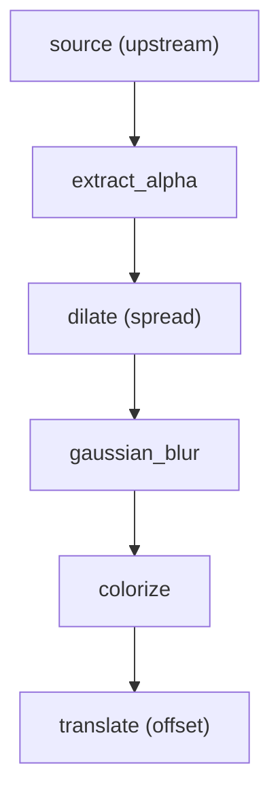
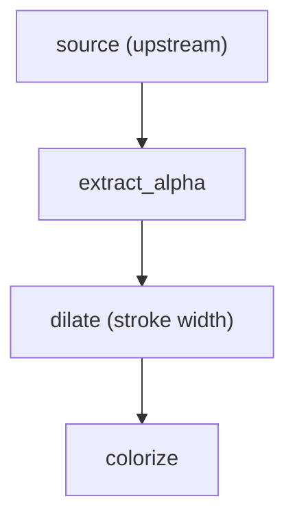
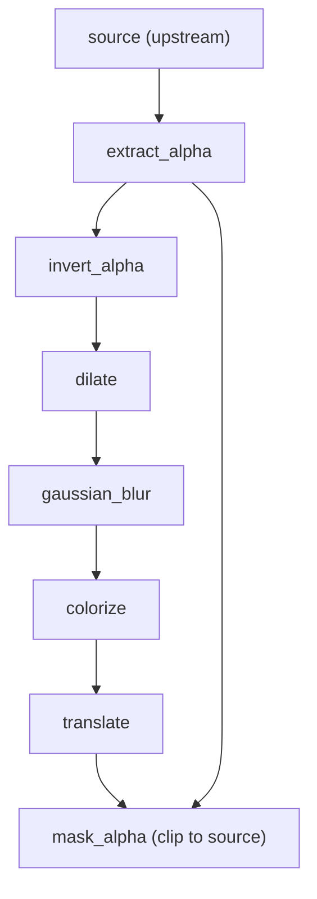
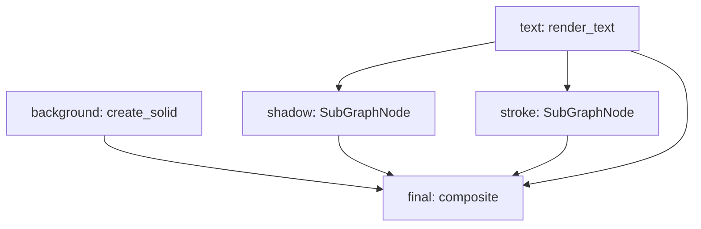

# **Effects: Filter Primitives and Pre-Bundled Subgraphs**

Visual effects (drop shadows, strokes, glows) are a core use case for Invariant GFX. Rather than building named effects as special-cased ops, the system decomposes effects into **orthogonal filter primitives** and then composes them as **subgraphs** — small DAG fragments that can be merged into any parent graph. Subgraphs are defined in [Subgraphs (Invariant)](https://github.com/kws/invariant/blob/main/docs/subgraphs.md).

This approach keeps the op surface area small, every intermediate result cacheable, and effects fully composable with each other.

## **1. Design Principles**

### **Effects Are Subgraphs, Not Ops**

A "drop shadow" is not a single op — it is a sequence of 5-7 primitive ops wired together as a DAG fragment. This is consistent with how Invariant GFX already works: `gfx:layout` + `gfx:composite` compose upstream artifacts without special-casing. Effects follow the same pattern at a higher level.

### **Primitives Over Special Cases**

Every named effect (shadow, stroke, glow, inner shadow) can be expressed as a combination of the same small set of filter primitives. This means:
- Fewer ops to implement and maintain
- Users can create novel effects by combining primitives in new ways
- Each primitive is independently cacheable — shared intermediate results are deduplicated

### **All Constraints Apply**

Filter primitives are standard Invariant GFX ops. They follow all existing constraints:
- **Immutability:** Filters consume and produce new `ImageArtifact` instances
- **Determinism:** No global state; all parameters in the manifest
- **Strict Numeric Policy:** `Decimal` or `int` for all numeric parameters (sigma, radius, opacity)
- **RGBA Standardization:** All images normalized to RGBA mode

## **2. Filter Primitives (Group E: Effects)**

These ops extend the standard library under the `gfx:` namespace. They operate on `ImageArtifact` inputs and produce `ImageArtifact` outputs.

### **Alpha / Mask Primitives**

Most effects work by manipulating the alpha channel of a source image — extracting the silhouette, modifying it, then colorizing and compositing the result.

#### **gfx:extract_alpha**

Extracts the alpha channel from an image, returning an alpha-only artifact.

* **Inputs:**
  * `image`: `ImageArtifact` (source image).
* **Output:** `ImageArtifact` — RGB channels zeroed, alpha channel preserved from source.
* **Use Case:** Isolating the shape/silhouette of text, icons, or other content for effect processing.

#### **gfx:invert_alpha**

Inverts the alpha channel of an image.

* **Inputs:**
  * `image`: `ImageArtifact` (alpha-channel image).
* **Output:** `ImageArtifact` — alpha values inverted (255 - original).
* **Use Case:** Creating the "negative space" mask needed for inner shadows.

#### **gfx:threshold_alpha**

Applies a binary threshold to the alpha channel.

* **Inputs:**
  * `image`: `ImageArtifact` (source image).
  * `t`: `int` (threshold value, 0-255).
* **Output:** `ImageArtifact` — alpha set to 255 where original >= `t`, 0 otherwise.
* **Use Case:** Producing crisp edges from blurred or anti-aliased masks.

#### **gfx:mask_alpha**

Applies a mask to an image's alpha channel.

* **Inputs:**
  * `image`: `ImageArtifact` (source image).
  * `mask`: `ImageArtifact` (mask image — alpha channel used).
* **Output:** `ImageArtifact` — source RGB preserved, alpha multiplied by mask alpha.
* **Use Case:** Clipping an effect to the interior of a source shape (inner shadows, highlights).

### **Morphology Primitives**

Morphological operations expand or contract the alpha channel, enabling strokes, spread shadows, and erosion effects.

#### **gfx:dilate**

Expands (grows) the alpha channel by a given radius.

* **Inputs:**
  * `image`: `ImageArtifact` (source image).
  * `radius`: `int` (expansion radius in pixels).
* **Output:** `ImageArtifact` — alpha channel dilated by `radius`.
* **Implementation:** Pillow `MaxFilter` of size `2 * radius + 1`, or equivalent morphological operation. The kernel size is deterministic for a given radius.
* **Use Case:** Creating stroke outlines, spread on drop shadows.

#### **gfx:erode**

Contracts (shrinks) the alpha channel by a given radius.

* **Inputs:**
  * `image`: `ImageArtifact` (source image).
  * `radius`: `int` (erosion radius in pixels).
* **Output:** `ImageArtifact` — alpha channel eroded by `radius`.
* **Implementation:** Pillow `MinFilter` of size `2 * radius + 1`.
* **Use Case:** Creating inset effects, edge detection (via dilate - erode).

### **Blur Primitives**

#### **gfx:gaussian_blur**

Applies Gaussian blur to an image.

* **Inputs:**
  * `image`: `ImageArtifact` (source image).
  * `sigma`: `Decimal` (blur radius / standard deviation).
* **Output:** `ImageArtifact` — blurred result.
* **Implementation:** Pillow `GaussianBlur(radius=...)` — the `radius` parameter is Pillow's name for standard deviation; we pass `sigma` directly. Effective kernel half-size is `ceil(3 * sigma)`; kernel size is `2 * ceil(3 * sigma) + 1`. Deterministic, no library-default "auto" behavior.
* **Use Case:** Softening shadows, creating glow falloff.

### **Geometric Primitives**

#### **gfx:translate**

Offsets an image by a pixel delta, expanding the canvas to accommodate the shift.

* **Inputs:**
  * `image`: `ImageArtifact` (source image).
  * `dx`: `int` (horizontal offset, positive = right).
  * `dy`: `int` (vertical offset, positive = down).
* **Output:** `ImageArtifact` — canvas expanded to fit the translated content. Original pixels shifted by `(dx, dy)`, vacated area is transparent.
* **Use Case:** Offsetting shadows and glows from their source.

#### **gfx:pad**

Expands the canvas by adding transparent padding around an image.

* **Inputs:**
  * `image`: `ImageArtifact` (source image).
  * `left`: `int` (padding in pixels).
  * `top`: `int` (padding in pixels).
  * `right`: `int` (padding in pixels).
  * `bottom`: `int` (padding in pixels).
* **Output:** `ImageArtifact` — canvas expanded by the specified padding. Original image centered within the new bounds.
* **Use Case:** Providing room for effects that expand beyond the source bounds (shadows, glows, strokes).

#### **gfx:crop**

Shrinks the canvas by removing pixels from the edges (inverse of pad).

* **Inputs:**
  * `image`: `ImageArtifact` (source image).
  * `left`: `int` (pixels to remove from left edge).
  * `top`: `int` (pixels to remove from top edge).
  * `right`: `int` (pixels to remove from right edge).
  * `bottom`: `int` (pixels to remove from bottom edge).
* **Output:** `ImageArtifact` — canvas reduced to the rectangle from `(left, top)` to `(width - right, height - bottom)`. Pixels outside that rectangle are discarded.
* **Constraint:** All insets must be non-negative and `left + right < width`, `top + bottom < height` (output must have positive dimensions).
* **Use Case:** Trimming expanded canvases after effects (e.g. undo pad, or crop back to content bounds); extracting a sub-region for thumbnails or tiles.

### **Color & Opacity Primitives**

#### **gfx:colorize**

Fills an image with a solid color, preserving the alpha channel.

* **Inputs:**
  * `image`: `ImageArtifact` (source — typically an alpha-only mask).
  * `color`: `tuple[int, int, int, int]` (RGBA, 0-255 per channel. Alpha component of the color is multiplied with the source alpha).
* **Output:** `ImageArtifact` — RGB channels set to the color, alpha channel from source multiplied by color alpha.
* **Use Case:** Turning an extracted alpha mask into a colored shadow or stroke.

#### **gfx:opacity**

Multiplies the alpha channel of an image by a factor.

* **Inputs:**
  * `image`: `ImageArtifact` (source image).
  * `factor`: `Decimal` (opacity multiplier, 0 to 1).
* **Output:** `ImageArtifact` — RGB preserved, alpha multiplied by `factor`.
* **Use Case:** Fading shadows, adjusting glow intensity.

## **3. Pre-Bundled Subgraphs (Effect Recipes)**

A **pre-bundled subgraph** for effects (an **effect recipe**) is a Python function that returns a **SubGraphNode**. The parent graph sees a single vertex with dependencies and one output artifact; the fact that the subgraph runs internal ops is invisible. For the SubGraphNode model, execution semantics, shared caching, and upstream (Invariant) requirements, see [Subgraphs (Invariant)](https://github.com/kws/invariant/blob/main/docs/subgraphs.md).

**Example:** an effect recipe is assigned to a node ID and referenced like any other node. (SubGraphNode semantics are in [Subgraphs (Invariant)](https://github.com/kws/invariant/blob/main/docs/subgraphs.md).)

```python
graph = {
    "background": Node(op_name="gfx:create_solid", params={...}, deps=[]),
    "text": Node(op_name="gfx:render_text", params={...}, deps=[]),
    "shadow": drop_shadow("text", dx=2, dy=2, sigma=Decimal("3")),  # Returns SubGraphNode; deps=["text"]
    "final": Node(
        op_name="gfx:composite",
        params={
            "layers": [
                {"image": ref("background"), "id": "background"},
                {"image": ref("shadow"), "id": "shadow"},
                {"image": ref("text"), "id": "text"},
            ],
        },
        deps=["background", "shadow", "text"],
    ),
}
```

## **4. Effect Recipes**

### **Drop Shadow**

The canonical shadow effect: extract the source silhouette, optionally spread it, blur, colorize, offset, and composite behind the source.

**DAG Structure:**



**Parameters:**

| Parameter | Type | Default | Description |
|:--|:--|:--|:--|
| `source` | `str` | (required) | Node ID of the source image (becomes the subgraph's dependency) |
| `dx` | `int` | `2` | Horizontal offset (positive = right) |
| `dy` | `int` | `2` | Vertical offset (positive = down) |
| `radius` | `int` | `0` | Spread radius (dilate before blur) |
| `sigma` | `Decimal` | `Decimal("3")` | Blur standard deviation |
| `color` | `tuple` | `(0, 0, 0, 180)` | Shadow color (RGBA) |

**Implementation:**

The recipe builds an internal graph whose only external dependency is the source image, passed in via context under the key `"source"`. The returned `SubGraphNode` has `deps=[source]` and `params={"source": ref(source), ...}` so the executor injects the source artifact into context when running the internal graph.

```python
from decimal import Decimal
from invariant import Node, ref
from invariant import SubGraphNode  # See Invariant docs: subgraphs.md

def drop_shadow(
    source: str,
    *,
    dx: int = 2,
    dy: int = 2,
    radius: int = 0,
    sigma: Decimal = Decimal("3"),
    color: tuple[int, int, int, int] = (0, 0, 0, 180),
) -> SubGraphNode:
    nodes = {}

    nodes["alpha"] = Node(
        op_name="gfx:extract_alpha",
        params={"image": ref("source")},
        deps=["source"],
    )

    prev = "alpha"

    if radius > 0:
        nodes["dilated"] = Node(
            op_name="gfx:dilate",
            params={"image": ref(prev), "radius": radius},
            deps=[prev],
        )
        prev = "dilated"

    nodes["blurred"] = Node(
        op_name="gfx:gaussian_blur",
        params={"image": ref(prev), "sigma": sigma},
        deps=[prev],
    )
    prev = "blurred"

    nodes["colored"] = Node(
        op_name="gfx:colorize",
        params={"image": ref(prev), "color": color},
        deps=[prev],
    )
    prev = "colored"

    if dx != 0 or dy != 0:
        nodes["offset"] = Node(
            op_name="gfx:translate",
            params={"image": ref(prev), "dx": dx, "dy": dy},
            deps=[prev],
        )
        prev = "offset"

    return SubGraphNode(
        params={"source": ref(source)},
        deps=[source],
        graph=nodes,
        output=prev,
    )
```

### **Outer Stroke**

Outlines the source silhouette with a solid-color border.

**DAG Structure:**



**Parameters:**

| Parameter | Type | Default | Description |
|:--|:--|:--|:--|
| `source` | `str` | (required) | Node ID of the source image (becomes the subgraph's dependency) |
| `width` | `int` | `2` | Stroke width in pixels |
| `color` | `tuple` | `(0, 0, 0, 255)` | Stroke color (RGBA) |

**Implementation:**

```python
def outer_stroke(
    source: str,
    *,
    width: int = 2,
    color: tuple[int, int, int, int] = (0, 0, 0, 255),
) -> SubGraphNode:
    nodes = {
        "alpha": Node(
            op_name="gfx:extract_alpha",
            params={"image": ref("source")},
            deps=["source"],
        ),
        "dilated": Node(
            op_name="gfx:dilate",
            params={"image": ref("alpha"), "radius": width},
            deps=["alpha"],
        ),
        "colored": Node(
            op_name="gfx:colorize",
            params={"image": ref("dilated"), "color": color},
            deps=["dilated"],
        ),
    }
    return SubGraphNode(
        params={"source": ref(source)},
        deps=[source],
        graph=nodes,
        output="colored",
    )
```

**Usage:** The stroke layer is composited *behind* the source, so the source's original pixels cover the inner portion of the dilated shape. The parent graph references the subgraph by a single node ID (e.g. `"stroke"`):

```python
graph["stroke"] = outer_stroke("text", width=3, color=(0, 0, 0, 255))

graph["final"] = Node(
    op_name="gfx:composite",
    params={
        "layers": [
            {"image": ref("background"), "id": "background"},
            {"image": ref("stroke"), "id": "stroke"},
            {"image": ref("text"), "id": "text"},
        ],
    },
    deps=["background", "stroke", "text"],
)
```

### **Outer Glow**

Identical structure to drop shadow but with no offset and typically a bright, saturated color. Composited with `"add"` blend mode for a luminous appearance.

**Parameters:**

| Parameter | Type | Default | Description |
|:--|:--|:--|:--|
| `source` | `str` | (required) | Node ID of the source image (dependency) |
| `radius` | `int` | `0` | Spread radius before blur |
| `sigma` | `Decimal` | `Decimal("5")` | Blur standard deviation |
| `color` | `tuple` | `(255, 200, 0, 200)` | Glow color (RGBA) |

This recipe reuses `drop_shadow(source, dx=0, dy=0, radius=..., sigma=..., color=...)`.

### **Inner Shadow**

Creates a shadow visible only inside the source shape — the "pressed" or "inset" look.

**DAG Structure:**



**Parameters:**

| Parameter | Type | Default | Description |
|:--|:--|:--|:--|
| `source` | `str` | (required) | Node ID of the source image (dependency) |
| `dx` | `int` | `1` | Horizontal offset |
| `dy` | `int` | `1` | Vertical offset |
| `radius` | `int` | `0` | Spread radius |
| `sigma` | `Decimal` | `Decimal("2")` | Blur standard deviation |
| `color` | `tuple` | `(0, 0, 0, 160)` | Shadow color (RGBA) |

**Implementation:**

```python
def inner_shadow(
    source: str,
    *,
    dx: int = 1,
    dy: int = 1,
    radius: int = 0,
    sigma: Decimal = Decimal("2"),
    color: tuple[int, int, int, int] = (0, 0, 0, 160),
) -> SubGraphNode:
    nodes = {}

    nodes["alpha"] = Node(
        op_name="gfx:extract_alpha",
        params={"image": ref("source")},
        deps=["source"],
    )

    nodes["inverted"] = Node(
        op_name="gfx:invert_alpha",
        params={"image": ref("alpha")},
        deps=["alpha"],
    )

    prev = "inverted"

    if radius > 0:
        nodes["dilated"] = Node(
            op_name="gfx:dilate",
            params={"image": ref(prev), "radius": radius},
            deps=[prev],
        )
        prev = "dilated"

    nodes["blurred"] = Node(
        op_name="gfx:gaussian_blur",
        params={"image": ref(prev), "sigma": sigma},
        deps=[prev],
    )
    prev = "blurred"

    nodes["colored"] = Node(
        op_name="gfx:colorize",
        params={"image": ref(prev), "color": color},
        deps=[prev],
    )
    prev = "colored"

    if dx != 0 or dy != 0:
        nodes["offset"] = Node(
            op_name="gfx:translate",
            params={"image": ref(prev), "dx": dx, "dy": dy},
            deps=[prev],
        )
        prev = "offset"

    nodes["clipped"] = Node(
        op_name="gfx:mask_alpha",
        params={"image": ref(prev), "mask": ref("alpha")},
        deps=[prev, "alpha"],
    )

    return SubGraphNode(
        params={"source": ref(source)},
        deps=[source],
        graph=nodes,
        output="clipped",
    )
```

**Usage:** The inner shadow is composited *above* the source using `"multiply"` or `"overlay"` blend mode. The parent graph assigns the subgraph to a node ID (e.g. `"inner_shadow"`) and references it like any other node:

```python
graph["inner_shadow"] = inner_shadow("text", dx=1, dy=2, sigma=Decimal("2"))

graph["final"] = Node(
    op_name="gfx:composite",
    params={
        "layers": [
            {"image": ref("background"), "id": "background"},
            {"image": ref("text"), "id": "text"},
            {"image": ref("inner_shadow"), "id": "inner_shadow", "mode": "multiply"},
        ],
    },
    deps=["background", "text", "inner_shadow"],
)
```

## **5. Composing Multiple Effects**

Because each effect is a single node (a SubGraphNode) in the parent graph, they compose naturally. The parent graph assigns each effect to a node ID and references those IDs in the final `gfx:composite`; internal ops are invisible and share the same ArtifactStore for caching.

**Example: Text with drop shadow and outer stroke**

```python
from decimal import Decimal
from invariant import Node, ref
from invariant_gfx.anchors import relative
from invariant_gfx.recipes import drop_shadow, outer_stroke

graph = {
    "background": Node(
        op_name="gfx:create_solid",
        params={"size": (Decimal("72"), Decimal("72")), "color": (40, 40, 40, 255)},
        deps=[],
    ),
    "text": Node(
        op_name="gfx:render_text",
        params={
            "text": "22°",
            "font": "Inter",
            "size": Decimal("24"),
            "color": (255, 255, 255, 255),
        },
        deps=[],
    ),
    "shadow": drop_shadow("text", dx=2, dy=2, sigma=Decimal("3")),
    "stroke": outer_stroke("text", width=2, color=(0, 0, 0, 200)),
    "final": Node(
        op_name="gfx:composite",
        params={
            "layers": [
                {"image": ref("background"), "id": "background"},
                {"image": ref("shadow"), "anchor": relative("background", "c@c", x=2, y=2)},
                {"image": ref("stroke"), "anchor": relative("background", "c@c")},
                {"image": ref("text"), "anchor": relative("background", "c@c")},
            ],
        },
        deps=["background", "shadow", "stroke", "text"],
    ),
}
```

**DAG structure (parent graph only):**

From the parent graph's perspective, `shadow` and `stroke` are opaque nodes — the executor does not expand them in the main graph. Dependencies and data flow are as follows:



When the executor runs `shadow` or `stroke`, it executes each node's internal graph with the same store; identical internal ops (e.g. `gfx:extract_alpha` on the same text artifact) are deduplicated via cache. If the text changes but the background does not, only the text-dependent nodes (including the two SubGraphNodes) re-execute; their internal nodes that depend on the new text artifact run, while any shared internal work remains cacheable.

## **6. Bounding Box Considerations**

Effects like blur and dilate expand the visual extent beyond the source's original bounds. Two strategies handle this:

### **Explicit Padding (Recommended)**

Use `gfx:pad` before applying the effect to ensure the canvas is large enough. This makes output dimensions intentional and predictable, which is important for downstream `gfx:composite` and `gfx:layout` operations.

```python
nodes["padded"] = Node(
    op_name="gfx:pad",
    params={
        "image": ref("source"),
        "left": pad, "top": pad, "right": pad, "bottom": pad,
    },
    deps=["source"],
)
```

The pad amount can be calculated from the effect parameters: `ceil(3 * sigma) + radius + max(abs(dx), abs(dy))`.

### **Auto-Expanding Ops**

Alternatively, `gfx:gaussian_blur` and `gfx:dilate` can auto-expand the canvas by the required amount. If this behavior is used, it must be documented as part of the op's contract — the output dimensions must be deterministic for given inputs. The expansion formula becomes part of the manifest.

For badge and button work, explicit padding is preferred because it keeps output size intentional and avoids surprises in layout calculations.

## **7. Determinism Notes**

Filter primitives must satisfy Invariant's determinism contract. Key considerations:

* **Blur kernel size:** `gfx:gaussian_blur` derives its kernel radius deterministically from `sigma` using `ceil(3 * sigma)`. This formula is part of the op specification — changing it changes the digest.
* **Morphology filter size:** `gfx:dilate` and `gfx:erode` use kernel size `2 * radius + 1`. Documented and fixed.
* **Decimal-to-int conversion:** When `sigma` (Decimal) must be converted to pixel values, the conversion rule (`ceil`, `round`, `floor`) is documented per-op and applied consistently.
* **No auto-detection:** No filter uses library-default "auto" parameters. All behavior-affecting values are explicit in the manifest.

## **8. Implementation Priority**

The filter primitives are ordered by impact — each tier unlocks a set of effect recipes.

### **Tier 1: Core Effects (Highest ROI)**

These eight primitives unlock drop shadow, outer stroke, and glow — the most common effects for badges and buttons.

| Op | Unlocks |
|:--|:--|
| `gfx:extract_alpha` | All effects (silhouette extraction) |
| `gfx:dilate` | Strokes, spread shadows |
| `gfx:gaussian_blur` | Soft shadows, glows |
| `gfx:colorize` | Colored shadows, strokes |
| `gfx:opacity` | Effect intensity control |
| `gfx:translate` | Shadow offset |
| `gfx:pad` | Canvas expansion for effects |
| `gfx:mask_alpha` | Inner shadows, clipped effects |

### **Tier 2: Extended Effects**

| Op | Unlocks |
|:--|:--|
| `gfx:invert_alpha` | Inner shadows, inverted masks |
| `gfx:erode` | Edge detection (dilate - erode), inset effects |
| `gfx:threshold_alpha` | Crisp mask edges from blurred sources |
| `gfx:crop` | Canvas trimming, sub-region extraction (inverse of pad) |

### **Tier 3: Advanced (Post-V1)**

| Op | Unlocks |
|:--|:--|
| `gfx:linear_gradient` | Highlights, gloss, badge fills |
| `gfx:brightness_contrast` | Level adjustments |

## **9. Relationship to Existing Ops**

The filter primitives complement — not replace — the existing standard library:

| Existing Op | Role with Effects |
|:--|:--|
| `gfx:composite` | Final assembly — stacks effect layers with source and background. Blend modes (`"multiply"`, `"screen"`, `"add"`) control how effects interact. |
| `gfx:layout` | Can arrange effect-processed content alongside other elements before compositing. |
| `gfx:create_solid` | Background canvases for composite operations that include effects. |
| `gfx:render_text` / `gfx:render_svg` | Source content that effects are applied to. |

## **10. Related Documents**

* [architecture.md](architecture.md) — Op standard library, artifact types, pipeline examples
* [Subgraphs (Invariant)](https://github.com/kws/invariant/blob/main/docs/subgraphs.md) — SubGraphNode model and execution semantics
* [composite.md](composite.md) — `gfx:composite` specification (blend modes, anchor functions)
* [layout.md](layout.md) — `gfx:layout` specification
* [status.md](status.md) — Implementation tracking
