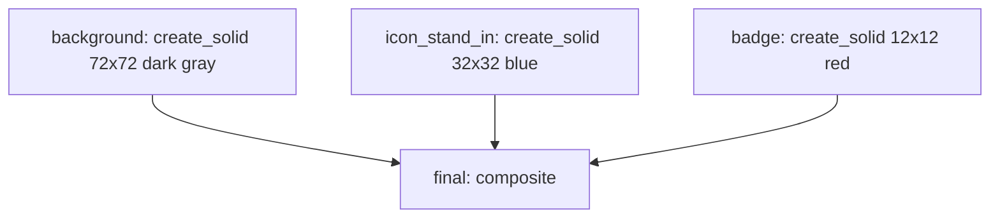
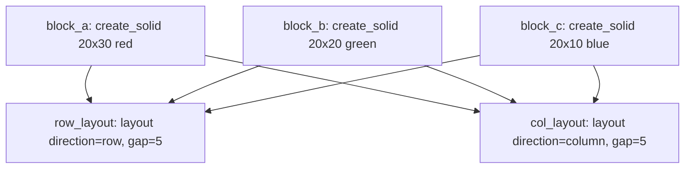
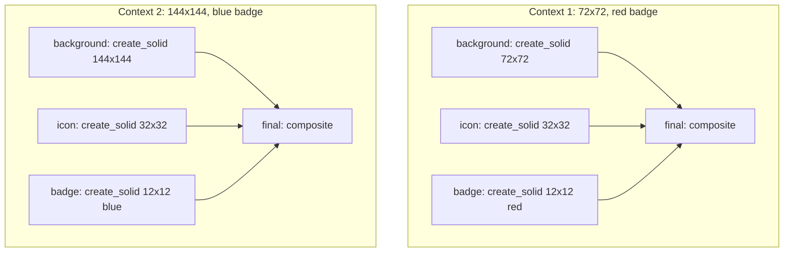

# **Reference Test Pipelines**

To validate Invariant GFX's core capabilities—composition, layout, anchoring, caching, and context injection—we need reference test cases that exercise complex DAG structures without requiring external font or icon dependencies. **Pure geometric compositions** serve as ideal reference implementations.

See [architecture.md](architecture.md) for the main system overview, op specifications, and template + context pattern.

## **1. Why Geometric Compositions**

Geometric compositions (colored rectangles, solid canvases) are well-suited for testing Invariant GFX because:

* **No external dependencies** — uses only `gfx:create_solid`, `gfx:resize`, `gfx:composite`, and `gfx:layout` (no fonts, icons, or network resources).
* **Pixel-verifiable** — output dimensions and pixel colors at known coordinates can be asserted programmatically.
* **Natural DAG structure** — composition pipelines require chains, fan-out, fan-in, and re-convergence.
* **Non-trivial cost** — image composition operations are O(width * height), making caching meaningful even in a test.
* **Graphics-specific patterns** — exercises anchoring, layout flow, and template reuse patterns unique to graphics pipelines.

## **2. Use Case 1: "Layered Badge" — Composition and Anchoring**

Tests the core composition engine with `absolute()` and `relative()` positioning. Three colored rectangles are stacked using different alignment modes.

**DAG Structure:**



**Complete Example:**

```python
from invariant import Node, Executor, OpRegistry, ref
from invariant.store.memory import MemoryStore
from invariant_gfx.artifacts import ImageArtifact
from invariant_gfx.anchors import absolute, relative
from decimal import Decimal

# Register graphics ops
registry = OpRegistry()
invariant_gfx.register_core_ops(registry)

# Define the graph
graph = {
    # Create three colored rectangles
    "background": Node(
        op_name="gfx:create_solid",
        params={
            "size": (Decimal("72"), Decimal("72")),
            "color": (40, 40, 40, 255),  # Dark gray RGBA
        },
        deps=[],
    ),
    "icon_stand_in": Node(
        op_name="gfx:create_solid",
        params={
            "size": (Decimal("32"), Decimal("32")),
            "color": (0, 100, 200, 255),  # Blue RGBA
        },
        deps=[],
    ),
    "badge": Node(
        op_name="gfx:create_solid",
        params={
            "size": (Decimal("12"), Decimal("12")),
            "color": (200, 0, 0, 255),  # Red RGBA
        },
        deps=[],
    ),
    # Composite: background at origin, icon centered, badge at icon's top-right
    "final": Node(
        op_name="gfx:composite",
        params={
            "layers": [
                {"image": ref("background"), "id": "background"},
                {"image": ref("icon_stand_in"), "anchor": relative("background", "c@c"), "id": "icon_stand_in"},
                {"image": ref("badge"), "anchor": relative("icon_stand_in", "se@se", x=-2, y=2), "id": "badge"},
            ],
        },
        deps=["background", "icon_stand_in", "badge"],
    ),
}

store = MemoryStore()
executor = Executor(registry=registry, store=store)
results = executor.execute(graph, ["final"])

# Verify output dimensions
assert results["final"].width == 72
assert results["final"].height == 72

# Verify pixel colors at known coordinates
final_image = results["final"].image
# Center pixel should be blue (icon)
assert final_image.getpixel((36, 36)) == (0, 100, 200, 255)
# Top-left corner should be dark gray (background)
assert final_image.getpixel((0, 0)) == (40, 40, 40, 255)
# Badge region should have red pixels
# Badge is positioned at icon's top-right, so approximately at (72-12-2, 0+2) = (58, 2)
assert final_image.getpixel((58, 2)) == (200, 0, 0, 255)
```

**Pipeline Features Exercised:**

| Pipeline Feature | Where It Appears | Notes |
|:--|:--|:--|
| **Source ops** | `background`, `icon_stand_in`, `badge` | Three independent `gfx:create_solid` nodes |
| **Composite with anchors** | `final` node | Three-layer composition |
| **`absolute()` anchoring** | `background` layer | Fixed pixel coordinates |
| **`relative()` with `"c@c"`** | `icon_stand_in` layer | Center alignment |
| **`relative()` with `"se@se"`** | `badge` layer | Start-end alignment (top-right) |
| **Fan-in (merge)** | `final` node | Three sources converge into one composite |
| **Pixel-level verification** | Assertions on `getpixel()` | Verifies correct positioning |

## **3. Use Case 2: "Content Flow" — Layout Engine**

Tests `gfx:layout` in both row and column modes with three differently-sized colored blocks. Demonstrates fan-out (same sources feed multiple layout nodes) and content-sized output.

**DAG Structure:**



**Complete Example:**

```python
from invariant import Node, Executor, OpRegistry, ref
from invariant.store.memory import MemoryStore
from invariant_gfx.artifacts import ImageArtifact
from decimal import Decimal

# Register graphics ops
registry = OpRegistry()
invariant_gfx.register_core_ops(registry)

# Define the graph
graph = {
    # Create three differently-sized colored blocks
    "block_a": Node(
        op_name="gfx:create_solid",
        params={
            "size": (Decimal("20"), Decimal("30")),
            "color": (200, 0, 0, 255),  # Red RGBA
        },
        deps=[],
    ),
    "block_b": Node(
        op_name="gfx:create_solid",
        params={
            "size": (Decimal("20"), Decimal("20")),
            "color": (0, 200, 0, 255),  # Green RGBA
        },
        deps=[],
    ),
    "block_c": Node(
        op_name="gfx:create_solid",
        params={
            "size": (Decimal("20"), Decimal("10")),
            "color": (0, 0, 200, 255),  # Blue RGBA
        },
        deps=[],
    ),
    # Row layout: horizontal arrangement
    "row_layout": Node(
        op_name="gfx:layout",
        params={
            "direction": "row",
            "align": "c",  # Center on cross-axis
            "gap": Decimal("5"),
            "items": [ref("block_a"), ref("block_b"), ref("block_c")],
        },
        deps=["block_a", "block_b", "block_c"],
    ),
    # Column layout: vertical arrangement
    "col_layout": Node(
        op_name="gfx:layout",
        params={
            "direction": "column",
            "align": "c",  # Center on cross-axis
            "gap": Decimal("5"),
            "items": [ref("block_a"), ref("block_b"), ref("block_c")],
        },
        deps=["block_a", "block_b", "block_c"],
    ),
}

store = MemoryStore()
executor = Executor(registry=registry, store=store)
results = executor.execute(graph, ["row_layout", "col_layout"])

# Verify row layout dimensions
# Width = 20 + 5 + 20 + 5 + 20 = 70
# Height = max(30, 20, 10) = 30
assert results["row_layout"].width == 70
assert results["row_layout"].height == 30

# Verify column layout dimensions
# Width = max(20, 20, 20) = 20
# Height = 30 + 5 + 20 + 5 + 10 = 70
assert results["col_layout"].width == 20
assert results["col_layout"].height == 70

# Verify pixel colors at expected positions
row_image = results["row_layout"].image
# First block (red) at left edge
assert row_image.getpixel((10, 15)) == (200, 0, 0, 255)
# Second block (green) in middle
assert row_image.getpixel((35, 10)) == (0, 200, 0, 255)
# Third block (blue) at right edge
assert row_image.getpixel((60, 5)) == (0, 0, 200, 255)

col_image = results["col_layout"].image
# First block (red) at top
assert col_image.getpixel((10, 15)) == (200, 0, 0, 255)
# Second block (green) in middle
assert col_image.getpixel((10, 42)) == (0, 200, 0, 255)
# Third block (blue) at bottom
assert col_image.getpixel((10, 65)) == (0, 0, 200, 255)
```

**Pipeline Features Exercised:**

| Pipeline Feature | Where It Appears | Notes |
|:--|:--|:--|
| **Source ops** | `block_a`, `block_b`, `block_c` | Three independent `gfx:create_solid` nodes |
| **`gfx:layout` row mode** | `row_layout` node | Horizontal arrangement with gap |
| **`gfx:layout` column mode** | `col_layout` node | Vertical arrangement with gap |
| **Cross-axis alignment** | Both layout nodes | `align: "c"` centers items on cross axis |
| **Fan-out** | `block_a`, `block_b`, `block_c` | Same source blocks feed two layout nodes |
| **Content-sized output** | Both layout nodes | Output dimensions derived from content |
| **Pixel-level verification** | Assertions on `getpixel()` | Verifies correct arrangement order |

## **4. Use Case 3: "Template Reuse" — Caching and Context**

Tests the template + context pattern: same graph executed with two different contexts, verifying intermediate artifact cache reuse. This reuses the Layered Badge graph but wraps background size and badge color as context-injected values.

**DAG Structure:**



**Complete Example:**

```python
from invariant import Node, Executor, OpRegistry
from invariant.store.chain import ChainStore
from invariant.store.memory import MemoryStore
from invariant.store.disk import DiskStore
from invariant_gfx.artifacts import ImageArtifact
from invariant_gfx.anchors import absolute, relative
from decimal import Decimal

# Register graphics ops
registry = OpRegistry()
invariant_gfx.register_core_ops(registry)

# Setup dual-cache for persistence across runs
store = ChainStore(
    l1=MemoryStore(),
    l2=DiskStore(),
)

executor = Executor(registry=registry, store=store)

# Define the template graph (context-injected values)
template = {
    "background": Node(
        op_name="gfx:create_solid",
        params={
            "size": (Decimal("${root.size.width}"), Decimal("${root.size.height}")),
            "color": (40, 40, 40, 255),  # Dark gray RGBA
        },
        deps=["root"],
    ),
    "icon": Node(
        op_name="gfx:create_solid",
        params={
            "size": (Decimal("32"), Decimal("32")),
            "color": (0, 100, 200, 255),  # Blue RGBA (same across runs)
        },
        deps=[],
    ),
    "badge": Node(
        op_name="gfx:create_solid",
        params={
            "size": (Decimal("12"), Decimal("12")),
            "color": (Decimal("${root.badge_color.r}"), Decimal("${root.badge_color.g}"), Decimal("${root.badge_color.b}"), Decimal("255")),
        },
        deps=["root"],
    ),
    "final": Node(
        op_name="gfx:composite",
        params={
            "layers": [
                {"image": ref("background"), "id": "background"},
                {"image": ref("icon"), "anchor": relative("background", "c@c"), "id": "icon"},
                {"image": ref("badge"), "anchor": relative("icon", "se@se", x=-2, y=2), "id": "badge"},
            ],
        },
        deps=["background", "icon", "badge"],
    ),
}

# First run: 72x72 canvas with red badge
context1 = {
    "root": {
        "size": {"width": 72, "height": 72},
        "badge_color": {"r": 200, "g": 0, "b": 0},
    },
}
results1 = executor.execute(graph=template, outputs=["final"], context=context1)
assert results1["final"].width == 72
assert results1["final"].height == 72

# Second run: 144x144 canvas with blue badge
context2 = {
    "root": {
        "size": {"width": 144, "height": 144},
        "badge_color": {"r": 0, "g": 0, "b": 200},
    },
}
results2 = executor.execute(graph=template, outputs=["final"], context=context2)
assert results2["final"].width == 144
assert results2["final"].height == 144

# Third run: same as first run — should cache-hit on all nodes
results3 = executor.execute(graph=template, outputs=["final"], context=context1)
assert results3["final"].width == 72
assert results3["final"].height == 72

# Verify icon artifact was reused across all runs (same size, same color)
# The icon node has no context dependencies, so it should produce identical artifacts
# Note: In a real implementation, you would verify cache hits via store introspection
```

**Pipeline Features Exercised:**

| Pipeline Feature | Where It Appears | Notes |
|:--|:--|:--|
| **Template pattern** | Graph definition | Reusable graph with context placeholders |
| **Context injection** | `background`, `badge` nodes | Size and color from context |
| **Cache reuse** | Second execution with context1 | Identical context produces cache hits |
| **Artifact deduplication** | `icon` node | Same icon artifact reused across runs |
| **Fan-in (merge)** | `final` node | Three sources converge into one composite |
| **Different outputs** | `results1` vs `results2` | Context controls output dimensions |

## **5. Pipeline Features Summary**

| Pipeline Feature | Use Case 1 | Use Case 2 | Use Case 3 |
|:--|:--|:--|:--|
| **Source ops** (`gfx:create_solid`) | Yes | Yes | Yes |
| **`gfx:composite` with anchors** | Yes | — | Yes |
| **`gfx:layout` (row/column)** | — | Yes | — |
| **`absolute()` anchoring** | Yes | — | Yes |
| **`relative()` anchoring** | Yes | — | Yes |
| **Fan-out** | — | Yes | — |
| **Fan-in (merge)** | Yes | — | Yes |
| **Context injection** | — | — | Yes |
| **Cache reuse** | — | — | Yes |
| **Pixel-level verification** | Yes | Yes | Yes |

These three reference pipelines collectively exercise all core graphics operations and DAG patterns in Invariant GFX, providing a comprehensive test suite that validates the system's correctness, caching behavior, and template reuse capabilities.
